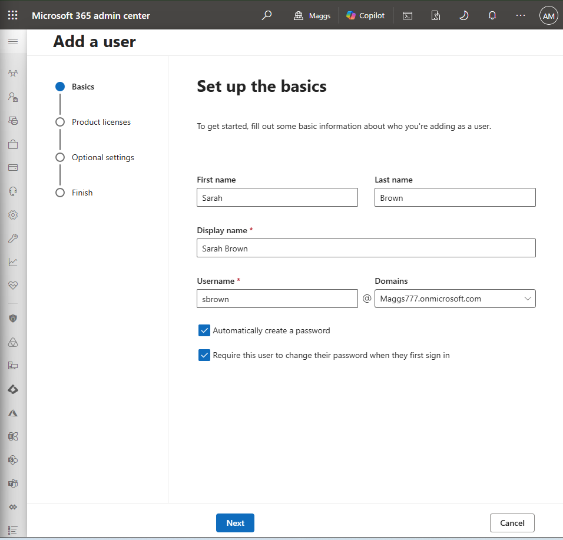
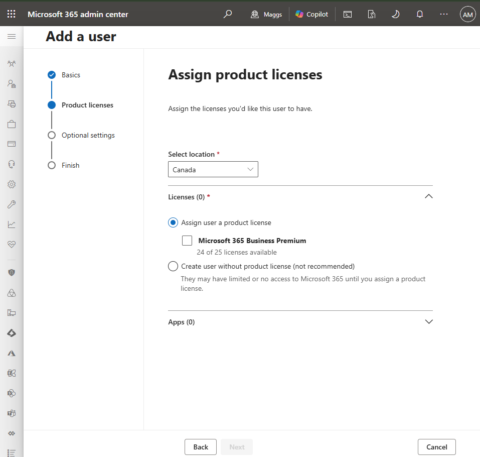
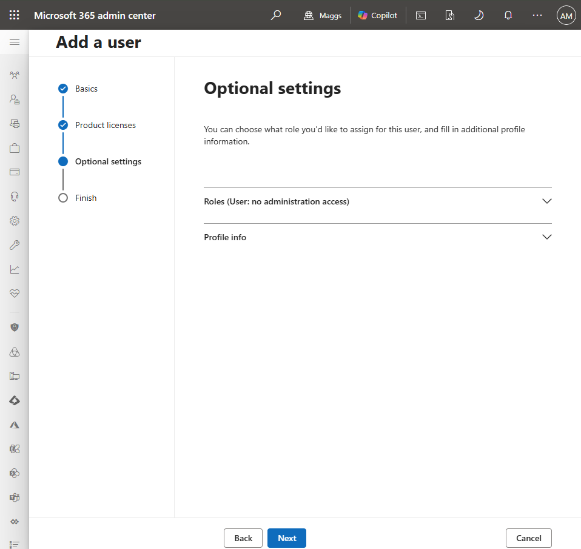
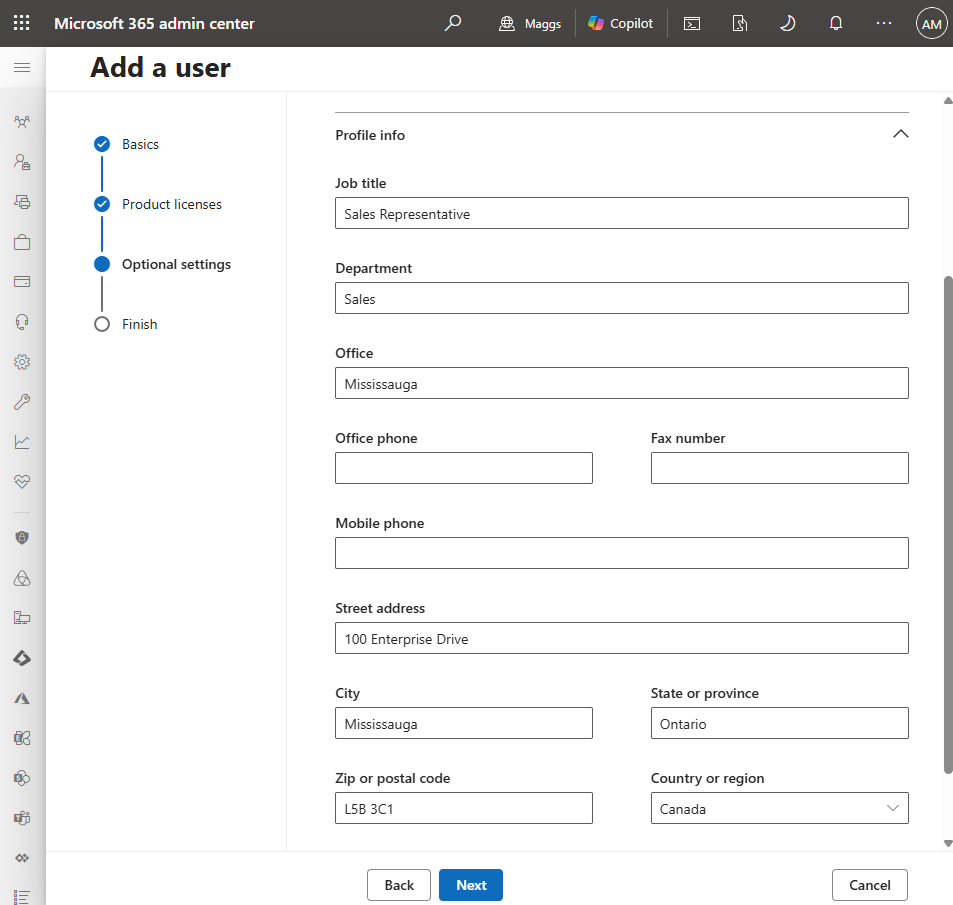
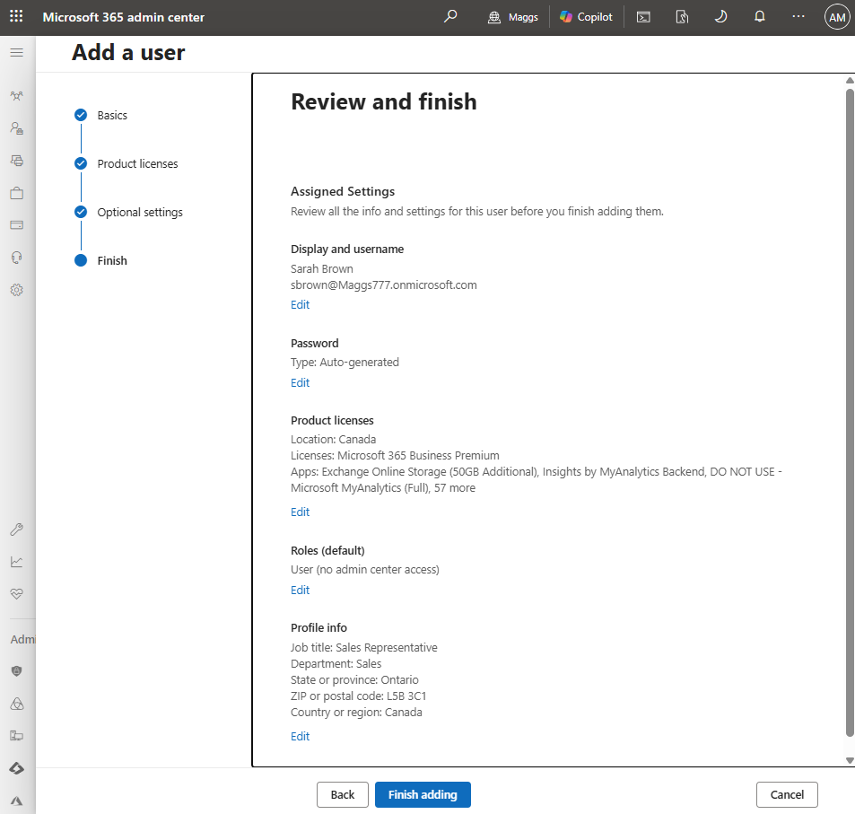
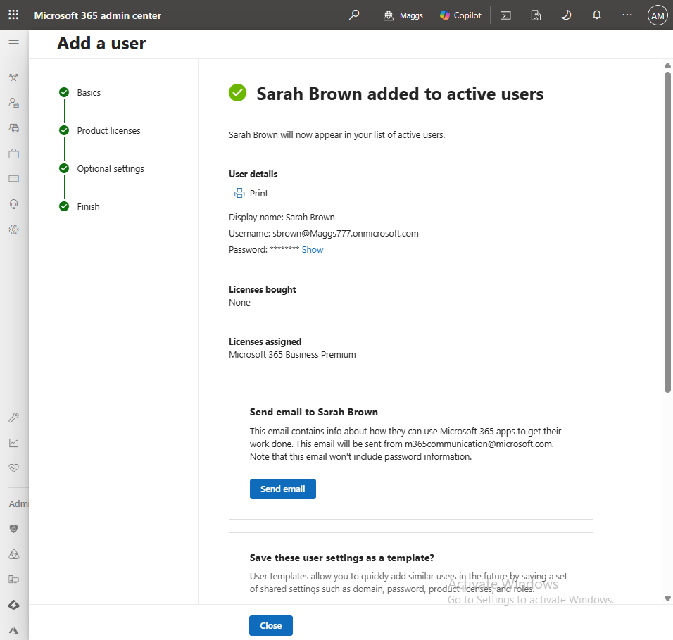
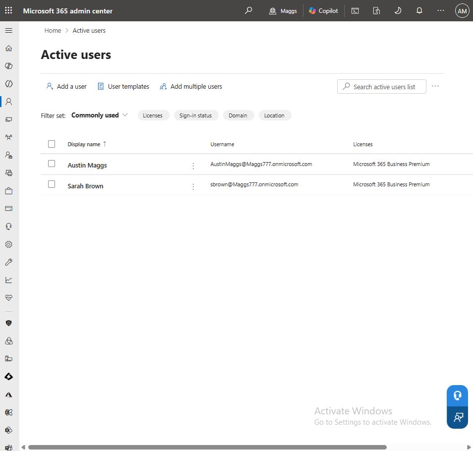

# M365-001 — User Creation and License Assignment

## Objective

Provision a new Microsoft 365 user account for a new employee, assign the appropriate Microsoft 365 Business Premium license, configure the employee's organizational profile, and verify successful account creation using the Microsoft 365 Admin Center.

---

## Ticket Information

**Ticket ID:** M365-001

**Priority:** Medium

**Category:** User Administration

**Status:** Completed

---

## Scenario

A new employee, Sarah Brown, has joined the Sales department at **Maggs Technology Services**.

The Help Desk received a request to provision a Microsoft 365 account, assign the appropriate Microsoft 365 license, configure the employee's profile information, and verify that the account was successfully created before onboarding.

---

## Environment

| Item | Value |
|---|---|
| Company | Maggs Technology Services |
| Tenant | Maggs777.onmicrosoft.com |
| Platform | Microsoft 365 Business Premium |
| Administration Portal | Microsoft 365 Admin Center |
| Identity Platform | Microsoft Entra ID |
| Administrator | Austin Maggs |
| New User | Sarah Brown |
| Username | sbrown@Maggs777.onmicrosoft.com |
| Department | Sales |
| Job Title | Sales Representative |
| Country | Canada |

---

# Resolution

## Step 1 — Configure Basic User Information

Created a new Microsoft 365 user account using the **Add User** wizard.

Configured the following information:

- First Name
- Last Name
- Display Name
- Username
- Default Tenant Domain

Enabled the following security settings:

- Automatically generate a secure temporary password
- Require the user to change their password at first sign-in

These settings follow Microsoft security best practices by ensuring every newly provisioned account begins with a strong password that only the end user will know after first login.

---

## Step 2 — Assign Microsoft 365 Business Premium License

Assigned a **Microsoft 365 Business Premium** license.

This license provides access to:

- Exchange Online
- Microsoft Teams
- SharePoint Online
- OneDrive for Business
- Microsoft Entra ID
- Microsoft Intune
- Microsoft Defender for Business
- Microsoft 365 Apps

The user's usage location was configured as **Canada** before license assignment.

---

## Step 3 — Configure User Profile Information

Configured organizational profile information including:

- Job Title
- Department
- Province
- Postal Code
- Country

Administrative permissions were left at the default **User (No Administration Access)** role.

Following the Principle of Least Privilege ensures users receive only the permissions required to perform their job responsibilities.

---

## Step 4 — Review Configuration

Reviewed all configuration settings prior to account creation.

Verified:

- User information
- Username
- License assignment
- Security settings
- User role
- Organizational profile

After verification, the account was successfully created.

A temporary password was automatically generated for first-time sign-in.

> **Note:** Temporary passwords should never be publicly disclosed. Any passwords shown in repository screenshots should be redacted before publication.

---

## Step 5 — Verify User Creation

Opened **Users → Active Users** to verify that the newly created account appeared successfully.

Confirmed:

- User account exists
- Business Premium license assigned
- Standard User role applied
- Account ready for employee onboarding

---

## Verification

The following items were successfully verified:

- ✔ User account successfully created
- ✔ Microsoft 365 Business Premium license assigned
- ✔ User appears in Active Users
- ✔ Standard User permissions applied
- ✔ Temporary password generated
- ✔ Password change required at first sign-in
- ✔ User profile information configured correctly

---

## Business Impact

Provisioning Microsoft 365 user accounts is a fundamental responsibility of Microsoft 365 administrators during employee onboarding.

Assigning the appropriate license ensures employees have immediate access to the Microsoft 365 services required to perform their job while preventing unnecessary licensing costs.

Applying the Principle of Least Privilege minimizes security risk by granting only the permissions required for the employee's role. Properly configured user profiles also improve directory accuracy, simplify administration, and support reporting, collaboration, and identity management throughout the organization.

---

## Best Practices

- Assign the appropriate Microsoft 365 license based on the employee's job role.
- Configure user profile information during account creation.
- Follow the Principle of Least Privilege.
- Require a password change during the first sign-in.
- Verify successful account creation before closing the ticket.
- Review license assignments regularly to prevent unnecessary licensing costs.
- Document all user provisioning activities for auditing and troubleshooting purposes.

---

## Screenshots

| Screenshot | Description |
|---|---|
| 01-User-Basics.png | Configure the new user's basic information. |
| 02-License-Assignment.png | Assign Microsoft 365 Business Premium license. |
| 03-Optional-Settings.png | Review optional configuration settings. |
| 04-Profile-Information.png | Configure organizational profile information. |
| 05-Review-and-Create.png | Review all settings before creating the account. |
| 06-Temporary-Password-Redacted.png | Temporary password generated after account creation *(redacted)*. |
| 07-Active-Users.png | Verify successful user creation in Active Users. |

---

## Skills Demonstrated

- Microsoft 365 Administration
- Microsoft Entra ID Administration
- Microsoft 365 User Provisioning
- Microsoft 365 Licensing
- Identity and Access Management (IAM)
- User Lifecycle Management
- Microsoft 365 Admin Center
- Microsoft Entra ID User Administration
- Employee Onboarding
- License Assignment
- Organizational Profile Management
- Principle of Least Privilege
- Microsoft Cloud Administration
- Identity Verification
- Enterprise Documentation

---

## References

- Microsoft 365 Admin Center
- Microsoft Entra Admin Center
- Microsoft Learn Documentation