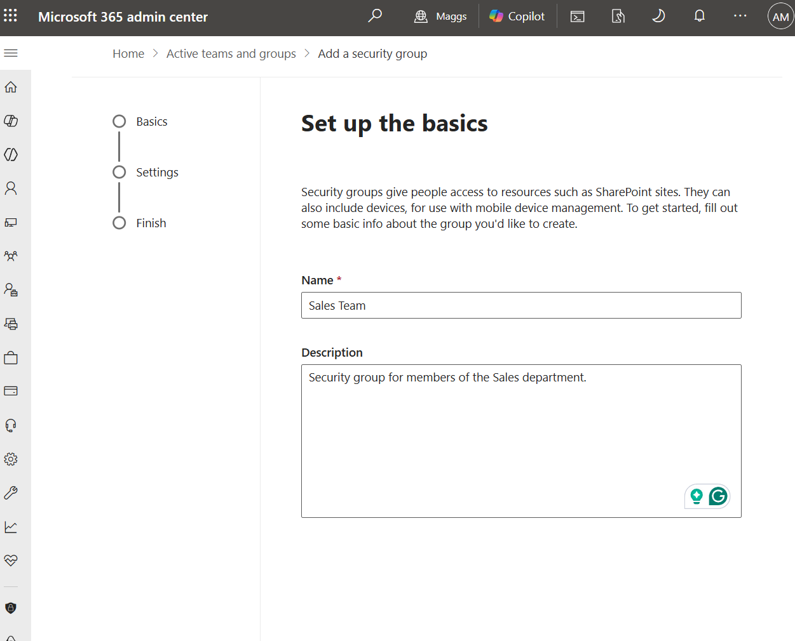
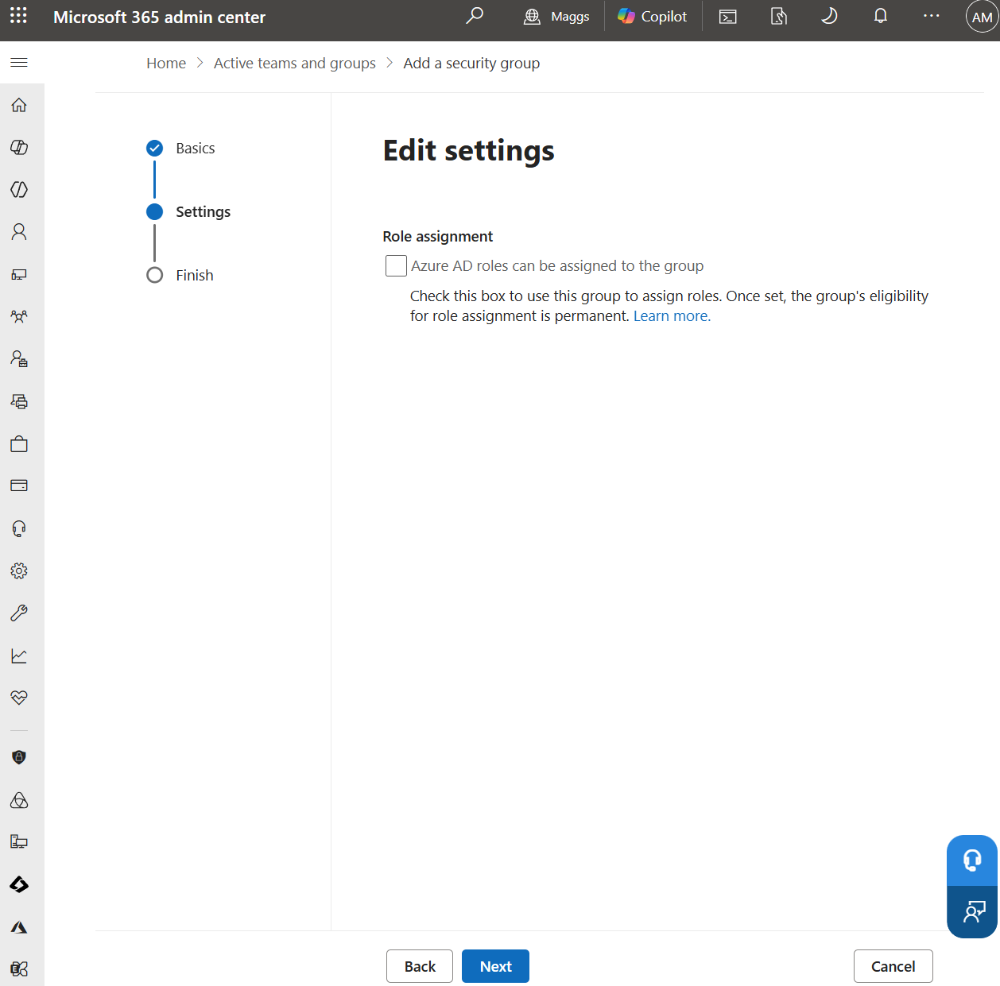
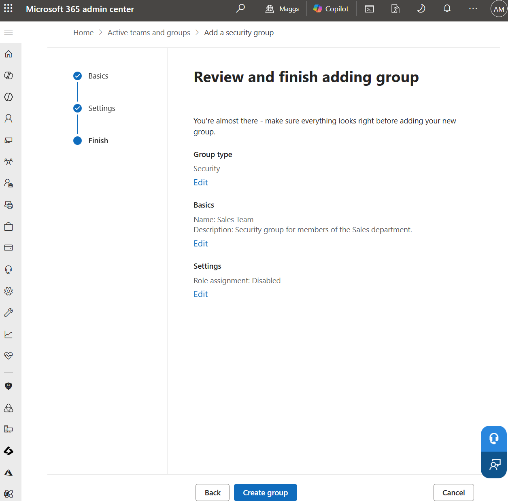
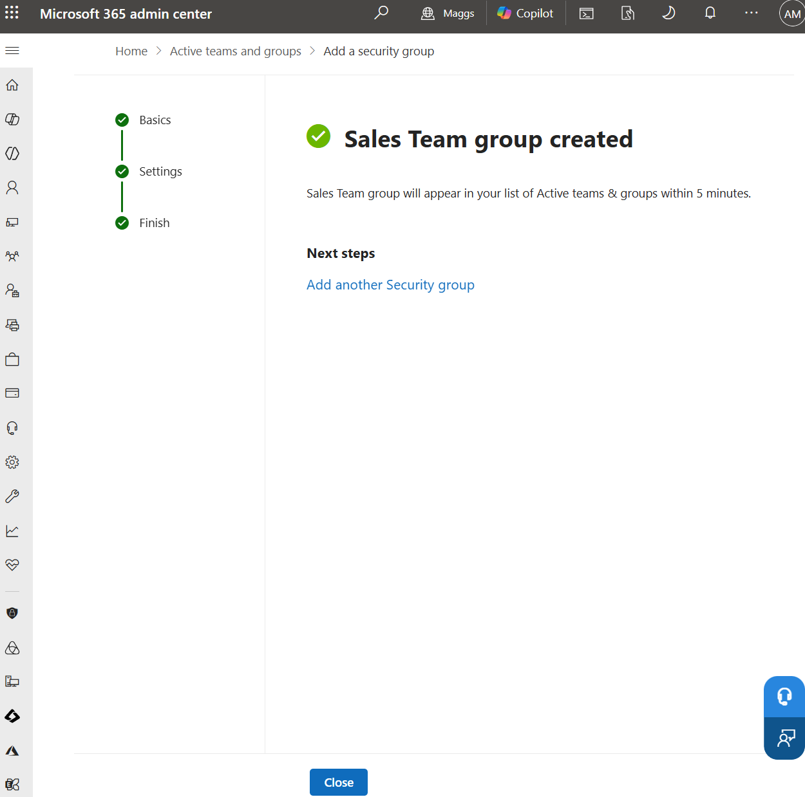
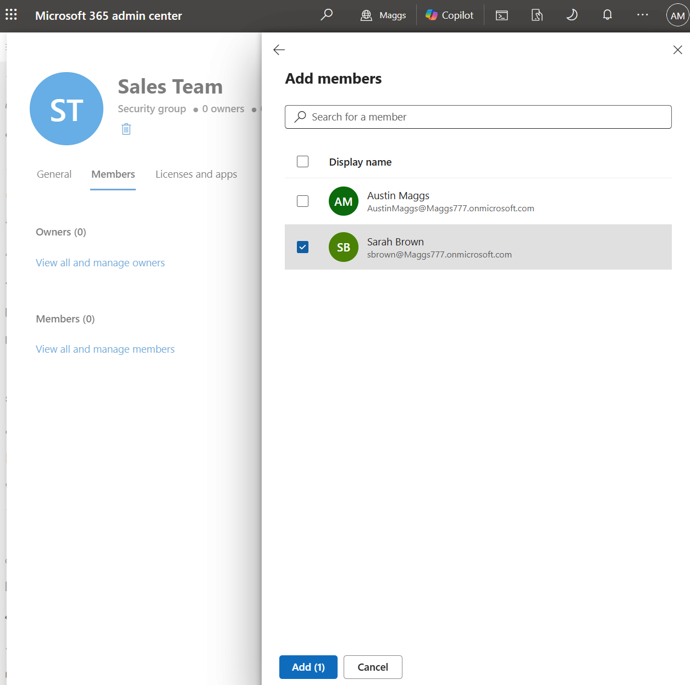
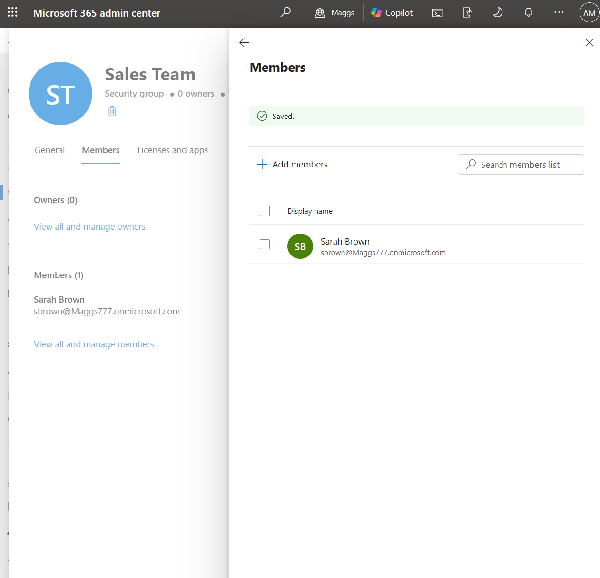

# M365-003 — Security Group Creation and Membership Management

## Objective

Create and configure a Microsoft 365 security group using the Microsoft 365 Admin Center and add a user as a member of the group.

This task demonstrates how security groups can be used to organize users and provide controlled access to organizational resources.

---

## Ticket Information

**Ticket ID:** M365-003

**Priority:** Medium

**Category:** Identity and Access Management

**Status:** Completed

---

## Scenario

The Sales department requires a dedicated security group to simplify access management for department resources.

A new security group named **Sales Team** must be created in the Microsoft 365 tenant.

After creating the group, the user **Sarah Brown** must be added as a member.

The completed configuration should be verified through the Microsoft 365 Admin Center.

---

## Environment

| Item | Value |
|---|---|
| Platform | Microsoft 365 |
| Administration Portal | Microsoft 365 Admin Center |
| Group Type | Security |
| Group Name | Sales Team |
| Group Description | Security group for members of the Sales department. |
| Member | Sarah Brown |
| User Principal Name | sbrown@Maggs777.onmicrosoft.com |
| Role Assignment | Disabled |

---

## Resolution Steps

### 1. Configure the Security Group

Navigated to the Microsoft 365 Admin Center and started the process of creating a new security group.

Configured the following group information:

- **Group Type:** Security
- **Name:** Sales Team
- **Description:** Security group for members of the Sales department.

---

### 2. Review Group Configuration Settings

Continued through the security group creation process and reviewed the available configuration settings.

---

### 3. Configure Role Assignment Settings

Reviewed the role assignment option for the security group.

The **Azure AD roles can be assigned to the group** option was left disabled because the Sales Team group is intended for standard security group membership and resource access rather than administrative role assignment.

---

### 4. Review and Create the Security Group

Reviewed the final group configuration before creation.

Verified the following settings:

- **Group Type:** Security
- **Name:** Sales Team
- **Description:** Security group for members of the Sales department.
- **Role Assignment:** Disabled

The configuration was confirmed and the security group was created.

---

### 5. Verify Security Group Creation

Confirmed that the **Sales Team** security group was successfully created in the Microsoft 365 tenant.

---

### 6. Add Sarah Brown to the Security Group

Opened the **Sales Team** security group and navigated to the group membership settings.

Selected **Sarah Brown** and added the account as a member of the security group.

---

### 7. Verify Group Membership

Verified that the membership change was successfully saved.

Confirmed that **Sarah Brown** appeared as a member of the **Sales Team** security group.

---

## Verification

The following configuration was successfully verified:

- The **Sales Team** security group was created.
- The group type was configured as **Security**.
- The group description was configured correctly.
- Administrative role assignment was left disabled.
- **Sarah Brown** was successfully added as a member.
- The membership change was saved successfully.
- Sarah Brown appeared in the final group membership list.

---

## Result

The **Sales Team** security group was successfully created and configured in the Microsoft 365 Admin Center.

The user **Sarah Brown** was successfully added to the group, and the final membership configuration was verified.

The Sales department now has a dedicated security group that can be used to manage access to organizational resources based on group membership.

---

## Skills Demonstrated

- Microsoft 365 Administration
- Microsoft 365 Admin Center
- Security Group Administration
- Group Membership Management
- Identity and Access Management
- User Access Management
- Microsoft Entra ID Concepts
- Role-Based Access Concepts
- Administrative Configuration
- Configuration Verification
- Technical Documentation
- Help Desk Administration

---

## Screenshots

| Screenshot | Description |
|---|---|
| M365-003-01-Security-Group-Creation.png | Configuring the Sales Team security group name and description |
| M365-003-02-Configure-Security-Group.png | Reviewing the security group configuration process |
| M365-003-03-Security-Group-Settings.png | Reviewing security group role assignment settings |
| M365-003-04-Review-and-Create-Security-Group.png | Reviewing the final security group configuration before creation |
| M365-003-05-Security-Group-Created.png | Confirmation that the Sales Team security group was successfully created |
| M365-003-06-Verify-Security-Group-Membership.png | Verification that Sarah Brown was successfully added to the Sales Team security group |