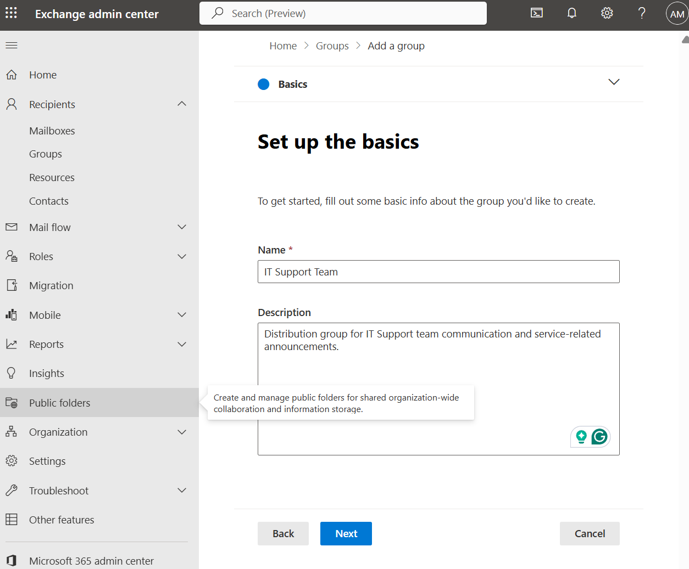
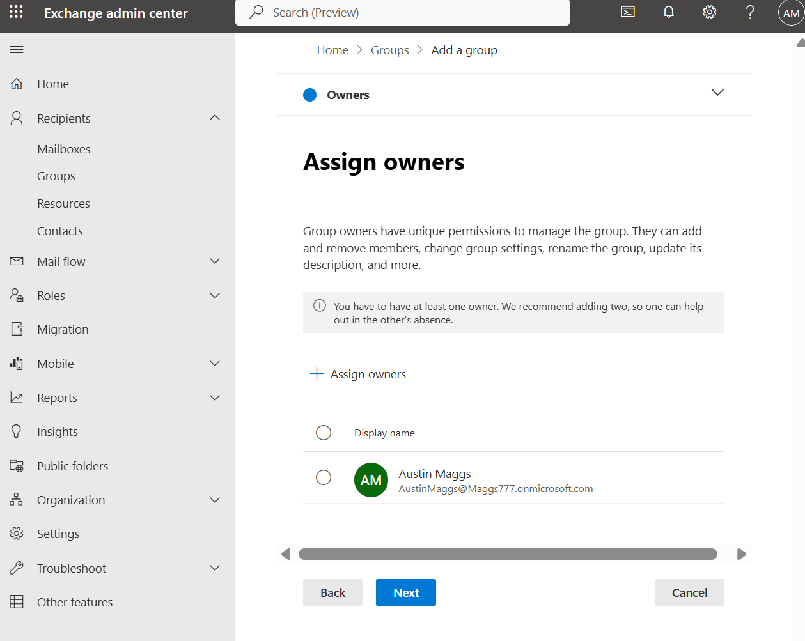
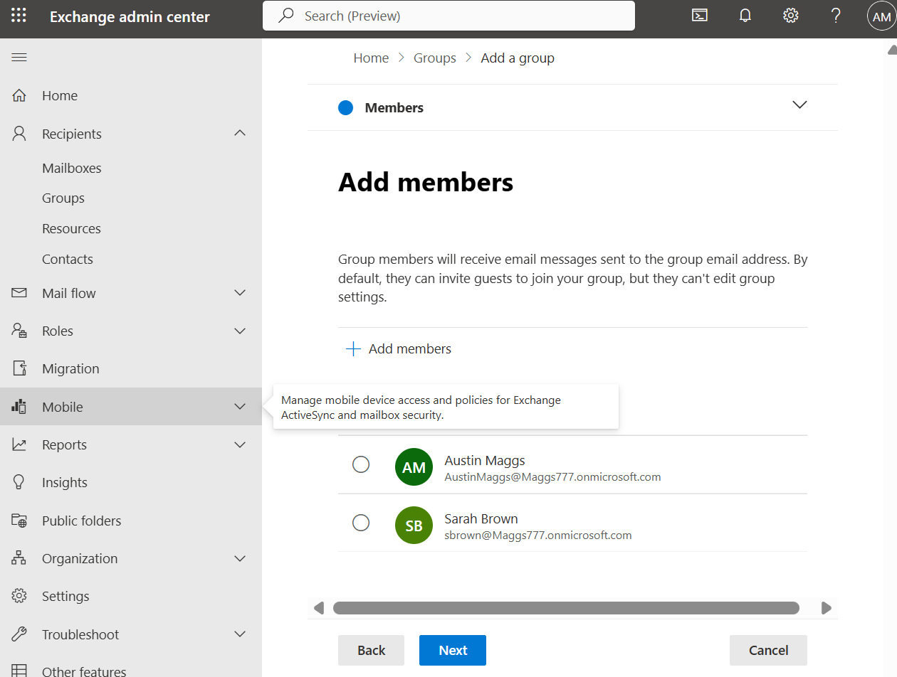
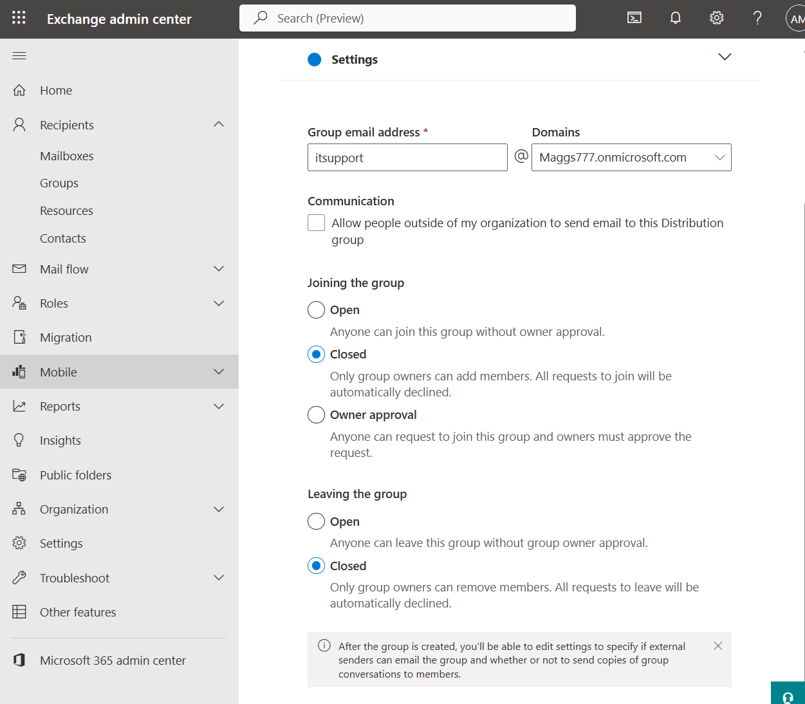
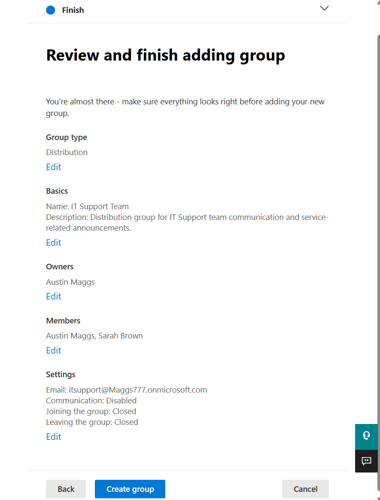
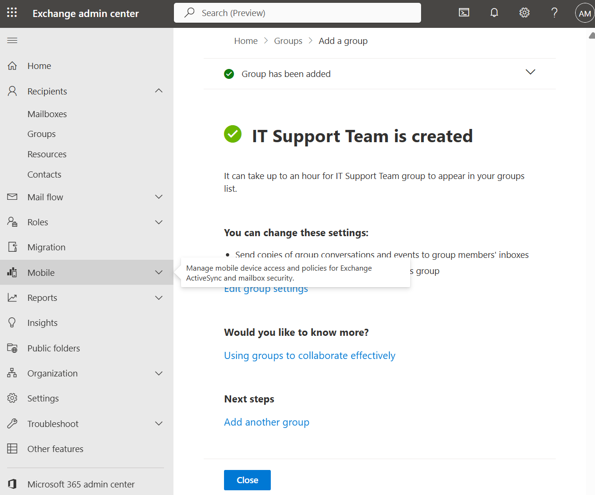
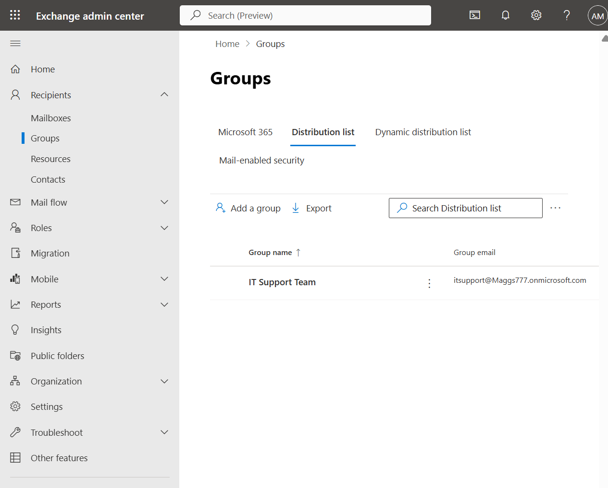

# M365-005 — Distribution Group Creation and Management

## Objective

Create and configure a distribution group in the Microsoft Exchange Admin Center to provide a centralized email address for team communication and service-related announcements.

This task demonstrates how Microsoft 365 administrators can create distribution groups, assign group ownership and membership, configure group communication and membership settings, and verify successful group creation.

---

## Ticket Information

**Ticket ID:** M365-005

**Priority:** Medium

**Category:** Exchange Online / Distribution Group Administration

**Status:** Completed

---

## Scenario

The IT Support team requires a centralized email distribution group to simplify communication between team members and distribute service-related announcements.

The administrator must create a new distribution group named **IT Support Team** and configure the appropriate owner, members, email address, and membership settings.

The distribution group will use the following configuration:

- **Group Name:** IT Support Team
- **Group Type:** Distribution
- **Group Email:** itsupport@Maggs777.onmicrosoft.com
- **Owner:** Austin Maggs
- **Members:** Austin Maggs and Sarah Brown
- **External Senders:** Disabled
- **Joining the Group:** Closed
- **Leaving the Group:** Closed

After creating the group, the administrator must verify that the distribution group appears in the Exchange Admin Center.

---

## Environment

| Item | Value |
|---|---|
| Platform | Microsoft 365 |
| Administration Portal | Exchange Admin Center |
| Service | Exchange Online |
| Group Type | Distribution Group |
| Group Name | IT Support Team |
| Group Email | itsupport@Maggs777.onmicrosoft.com |
| Owner | Austin Maggs |
| Members | Austin Maggs, Sarah Brown |
| External Senders | Disabled |
| Joining Policy | Closed |
| Leaving Policy | Closed |

---

## Resolution Steps

### 1. Configure Distribution Group Basics

Opened the **Exchange Admin Center** and navigated to:

**Recipients → Groups → Add a group**

Selected **Distribution** as the group type and proceeded to configure the basic information for the new distribution group.

The following values were entered:

- **Name:** IT Support Team
- **Description:** Distribution group for IT Support team communication and service-related announcements.

A distribution group provides a centralized email address that distributes messages sent to the group address to its members.

---

### 2. Assign Group Owner

Assigned **Austin Maggs** as the owner of the distribution group.

Group owners have permissions to manage the group, including managing membership and modifying group settings.

Assigning an owner ensures that responsibility for maintaining the distribution group is clearly defined.

---

### 3. Add Group Members

Added the following users as members of the distribution group:

- Austin Maggs
- Sarah Brown

Members of the distribution group receive email messages sent to the group's centralized email address.

This configuration allows messages sent to the **IT Support Team** distribution address to be distributed to the configured group members.

---

### 4. Configure Distribution Group Settings

Configured the distribution group email address as:

**itsupport@Maggs777.onmicrosoft.com**

The following communication and membership settings were configured:

- **External Senders:** Disabled
- **Joining the Group:** Closed
- **Leaving the Group:** Closed

Disabling external senders restricts messages from outside the organization from being sent to the distribution group.

Setting **Joining the Group** to **Closed** ensures that only group owners can add members.

Setting **Leaving the Group** to **Closed** ensures that only group owners can remove members.

These settings provide greater administrative control over group membership and communication.

---

### 5. Review Distribution Group Configuration

Reviewed the complete distribution group configuration before creating the group.

The configuration confirmed:

- **Group Type:** Distribution
- **Name:** IT Support Team
- **Owner:** Austin Maggs
- **Members:** Austin Maggs and Sarah Brown
- **Email:** itsupport@Maggs777.onmicrosoft.com
- **External Communication:** Disabled
- **Joining the Group:** Closed
- **Leaving the Group:** Closed

The configuration was reviewed to ensure that the correct group type, ownership, membership, email address, and access settings were applied.

---

### 6. Create Distribution Group

Selected **Create group** to complete the configuration.

The Exchange Admin Center confirmed that the **IT Support Team** group was successfully created.

This confirmed that the distribution group configuration had been accepted and provisioned in Exchange Online.

---

### 7. Verify Distribution Group Creation

Returned to:

**Recipients → Groups → Distribution list**

Verified that the newly created **IT Support Team** distribution group appeared in the distribution list.

The group was displayed with the configured email address:

**itsupport@Maggs777.onmicrosoft.com**

This confirmed that the distribution group was successfully created and available within Exchange Online.

---

## Verification

The distribution group configuration was reviewed in the Exchange Admin Center.

The following settings were verified:

| Setting | Configuration | Status |
|---|---|---|
| Group Type | Distribution | Configured |
| Group Name | IT Support Team | Configured |
| Group Email | itsupport@Maggs777.onmicrosoft.com | Configured |
| Owner | Austin Maggs | Configured |
| Members | Austin Maggs, Sarah Brown | Configured |
| External Senders | Disabled | Configured |
| Joining Policy | Closed | Configured |
| Leaving Policy | Closed | Configured |

The **IT Support Team** group was also verified in the Exchange Admin Center distribution list with the configured email address.

---

## Result

The **IT Support Team** distribution group was successfully created and configured in Exchange Online.

The group provides a centralized email address for IT Support team communication:

**itsupport@Maggs777.onmicrosoft.com**

Austin Maggs was assigned as the group owner, and Austin Maggs and Sarah Brown were configured as group members.

External senders were disabled, and group joining and leaving policies were configured as closed to maintain administrative control over membership.

The final distribution list was reviewed to verify that the group was successfully created and available within Exchange Online.

---

## Skills Demonstrated

- Microsoft 365 Administration
- Exchange Online Administration
- Exchange Admin Center
- Distribution Group Administration
- Distribution List Management
- Group Creation and Configuration
- Group Ownership Management
- Group Membership Management
- Email Distribution Management
- Access Control
- Administrative Verification
- Technical Documentation

---

## Key Takeaways

- Distribution groups provide a centralized email address for sending messages to multiple users simultaneously.
- Group owners can be assigned responsibility for managing group membership and configuration.
- Distribution group membership can be centrally controlled by administrators and group owners.
- External sender restrictions can help control whether messages from outside the organization can reach a distribution group.
- Closed joining policies prevent users from independently joining the group.
- Closed leaving policies ensure that membership removal remains under group owner control.
- Distribution group configuration should be reviewed before creation and verified afterward to confirm successful deployment.

---

## Conclusion

This task demonstrated the process of creating and configuring a distribution group using the Microsoft Exchange Admin Center.

The **IT Support Team** distribution group was configured with an organizational email address, designated group owner, defined membership, restricted external communication, and controlled membership policies.

The completed configuration demonstrates practical experience with Exchange Online administration, distribution group management, group ownership, membership administration, access control, and administrative verification within a Microsoft 365 environment.