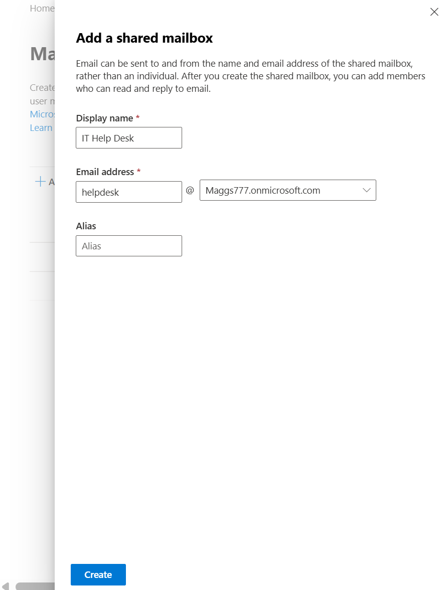
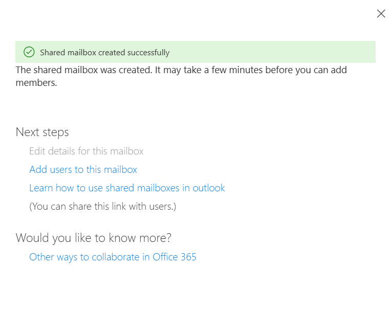
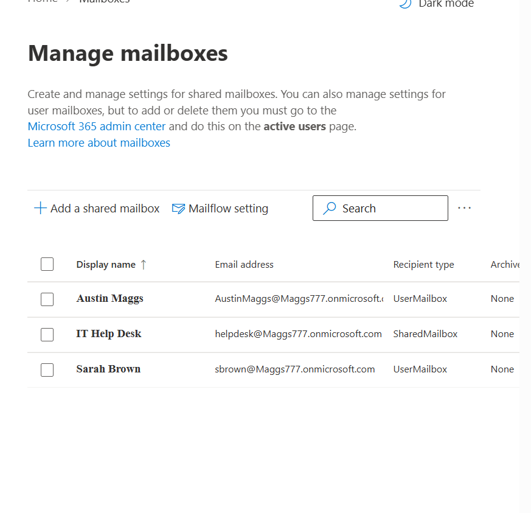
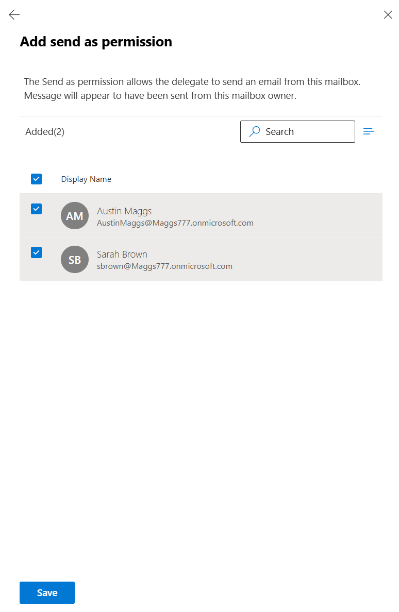
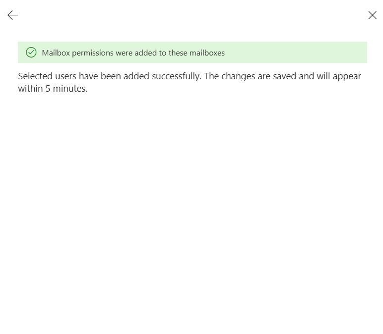
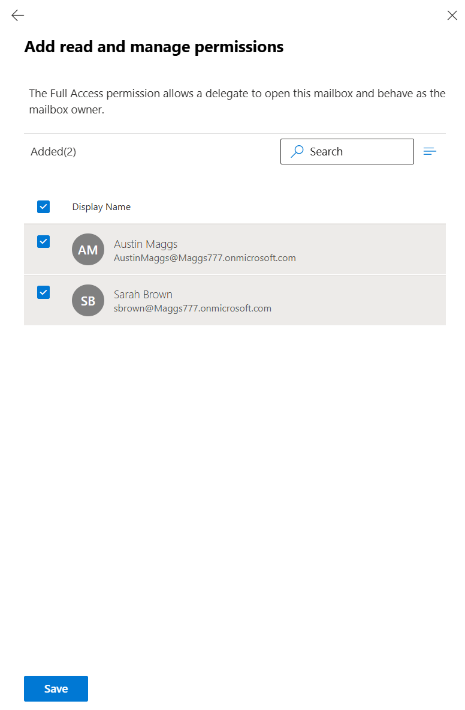
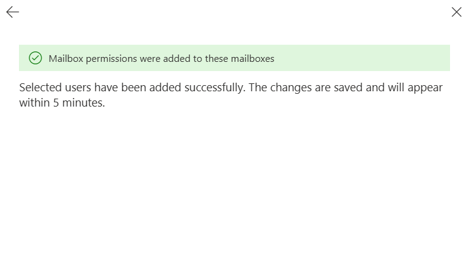
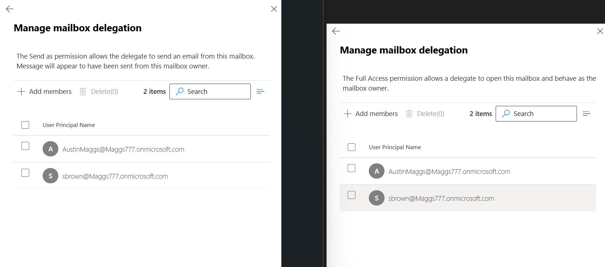

# M365-006 — Shared Mailbox Creation and Management

## Objective

Create and configure a shared mailbox in the Microsoft Exchange Admin Center to provide a centralized email address that authorized team members can access and use for IT Help Desk communications.

This task demonstrates how Microsoft 365 administrators can create shared mailboxes, configure mailbox delegation permissions, grant Full Access and Send As permissions, and verify successful mailbox creation and permission assignment.

---

## Ticket Information

**Ticket ID:** M365-006

**Priority:** Medium

**Category:** Exchange Online / Shared Mailbox Administration

**Status:** Completed

---

## Scenario

The IT Help Desk requires a centralized shared mailbox that multiple authorized team members can access to manage incoming communications and respond to users from a common organizational email address.

The administrator must create a new shared mailbox named **IT Help Desk** and configure the appropriate email address and mailbox delegation permissions.

The shared mailbox will use the following configuration:

- **Shared Mailbox Name:** IT Help Desk
- **Mailbox Type:** Shared Mailbox
- **Email Address:** helpdesk@Maggs777.onmicrosoft.com
- **Authorized Users:** Austin Maggs and Sarah Brown
- **Read and Manage (Full Access):** Austin Maggs and Sarah Brown
- **Send As:** Austin Maggs and Sarah Brown

After creating the shared mailbox, the administrator must verify that the mailbox appears in the Exchange Admin Center and confirm that the required mailbox delegation permissions were successfully assigned.

---

## Environment

| Item | Value |
|---|---|
| Platform | Microsoft 365 |
| Administration Portal | Exchange Admin Center |
| Service | Exchange Online |
| Mailbox Type | Shared Mailbox |
| Display Name | IT Help Desk |
| Email Address | helpdesk@Maggs777.onmicrosoft.com |
| Authorized Users | Austin Maggs, Sarah Brown |
| Full Access | Austin Maggs, Sarah Brown |
| Send As | Austin Maggs, Sarah Brown |

---

## Resolution Steps

### 1. Configure Shared Mailbox

Opened the **Exchange Admin Center** and navigated to:

**Recipients → Mailboxes → Add a shared mailbox**

Configured the new shared mailbox with the following values:

- **Display Name:** IT Help Desk
- **Email Address:** helpdesk@Maggs777.onmicrosoft.com

A shared mailbox provides a centralized email address that multiple authorized users can access for collaborative communication without requiring users to share individual account credentials.

---

### 2. Create Shared Mailbox

Selected **Create** to provision the new shared mailbox.

The Exchange Admin Center confirmed that the shared mailbox was created successfully.

This confirmed that the **IT Help Desk** shared mailbox configuration had been accepted and provisioned within Exchange Online.

---

### 3. Verify Shared Mailbox Creation

Returned to the mailbox management interface and verified that the newly created **IT Help Desk** mailbox appeared in the mailbox list.

The mailbox was displayed with the configured email address:

**helpdesk@Maggs777.onmicrosoft.com**

The recipient type was displayed as **SharedMailbox**, confirming that the mailbox had been successfully provisioned as a shared mailbox rather than a standard user mailbox.

---

### 4. Configure Send As Permissions

Opened the mailbox delegation settings for the **IT Help Desk** shared mailbox.

Configured **Send As** permissions for the following users:

- Austin Maggs
- Sarah Brown

The **Send As** permission allows authorized delegates to send email messages using the shared mailbox identity.

Messages sent using this permission appear to recipients as though they were sent directly from the **IT Help Desk** shared mailbox rather than from the individual delegate's personal mailbox.

---

### 5. Confirm Send As Permission Assignment

Saved the configured **Send As** permissions.

The Exchange Admin Center confirmed that the mailbox permissions were successfully added.

This confirmed that the selected users had been assigned the required Send As delegation permissions.

---

### 6. Configure Read and Manage Permissions

Configured **Read and Manage (Full Access)** permissions for the following users:

- Austin Maggs
- Sarah Brown

The **Full Access** permission allows an authorized delegate to open and manage the shared mailbox.

This enables the authorized users to access the **IT Help Desk** mailbox and manage mailbox content as part of their support responsibilities.

---

### 7. Confirm Full Access Permission Assignment

Saved the configured **Read and Manage (Full Access)** permissions.

The Exchange Admin Center confirmed that the mailbox permissions were successfully added.

This confirmed that Austin Maggs and Sarah Brown had been granted the required Full Access permissions to the shared mailbox.

---

### 8. Verify Mailbox Delegation

Returned to the mailbox delegation settings to verify that the configured permissions were successfully applied.

The following delegation permissions were verified:

**Send As:**

- Austin Maggs
- Sarah Brown

**Read and Manage (Full Access):**

- Austin Maggs
- Sarah Brown

The presence of both users under each permission type confirmed that the required mailbox delegation configuration had been successfully applied to the **IT Help Desk** shared mailbox.

---

## Verification

The shared mailbox configuration and mailbox delegation permissions were reviewed in the Exchange Admin Center.

The following settings were verified:

| Setting | Configuration | Status |
|---|---|---|
| Mailbox Type | Shared Mailbox | Configured |
| Display Name | IT Help Desk | Configured |
| Email Address | helpdesk@Maggs777.onmicrosoft.com | Configured |
| Full Access — Austin Maggs | Granted | Configured |
| Full Access — Sarah Brown | Granted | Configured |
| Send As — Austin Maggs | Granted | Configured |
| Send As — Sarah Brown | Granted | Configured |

The **IT Help Desk** mailbox was also verified in the Exchange Admin Center mailbox list with the recipient type **SharedMailbox**.

Mailbox delegation settings were reviewed after configuration to confirm that both Austin Maggs and Sarah Brown appeared under the **Send As** and **Read and Manage (Full Access)** permission lists.

---

## Result

The **IT Help Desk** shared mailbox was successfully created and configured in Exchange Online.

The shared mailbox provides a centralized email address for IT Help Desk communications:

**helpdesk@Maggs777.onmicrosoft.com**

Austin Maggs and Sarah Brown were granted **Read and Manage (Full Access)** permissions, allowing both users to access and manage the shared mailbox.

Austin Maggs and Sarah Brown were also granted **Send As** permissions, allowing both users to send email using the identity of the IT Help Desk shared mailbox.

The final mailbox delegation configuration was reviewed in the Exchange Admin Center to verify that all required permissions were successfully applied.

---

## Skills Demonstrated

- Microsoft 365 Administration
- Exchange Online Administration
- Exchange Admin Center
- Shared Mailbox Administration
- Shared Mailbox Creation and Configuration
- Mailbox Delegation
- Full Access Permission Management
- Send As Permission Management
- User Access Management
- Access Control
- Permission Assignment
- Administrative Verification
- Technical Documentation

---

## Key Takeaways

- Shared mailboxes provide a centralized mailbox that multiple authorized users can access for collaborative communication.
- Shared mailboxes allow teams to communicate using a common organizational email identity.
- Full Access permissions allow authorized delegates to open and manage a shared mailbox.
- Send As permissions allow authorized delegates to send messages that appear to originate directly from the shared mailbox.
- Full Access and Send As permissions serve different administrative purposes and must be configured according to user responsibilities.
- Mailbox delegation provides administrators with granular control over which users can access and send email from shared mailboxes.
- Mailbox creation should be verified in the Exchange Admin Center to confirm that the correct mailbox type and email address were provisioned.
- Delegation permissions should be reviewed after configuration to verify that the required users have been successfully assigned.

---

## Conclusion

This task demonstrated the process of creating and configuring a shared mailbox using the Microsoft Exchange Admin Center.

The **IT Help Desk** shared mailbox was configured with the organizational email address **helpdesk@Maggs777.onmicrosoft.com**.

Austin Maggs and Sarah Brown were granted **Read and Manage (Full Access)** permissions to access and manage the mailbox and **Send As** permissions to send messages using the shared mailbox identity.

The completed configuration demonstrates practical experience with Exchange Online administration, shared mailbox management, mailbox delegation, Full Access permission management, Send As permission management, access control, and administrative verification within a Microsoft 365 environment.