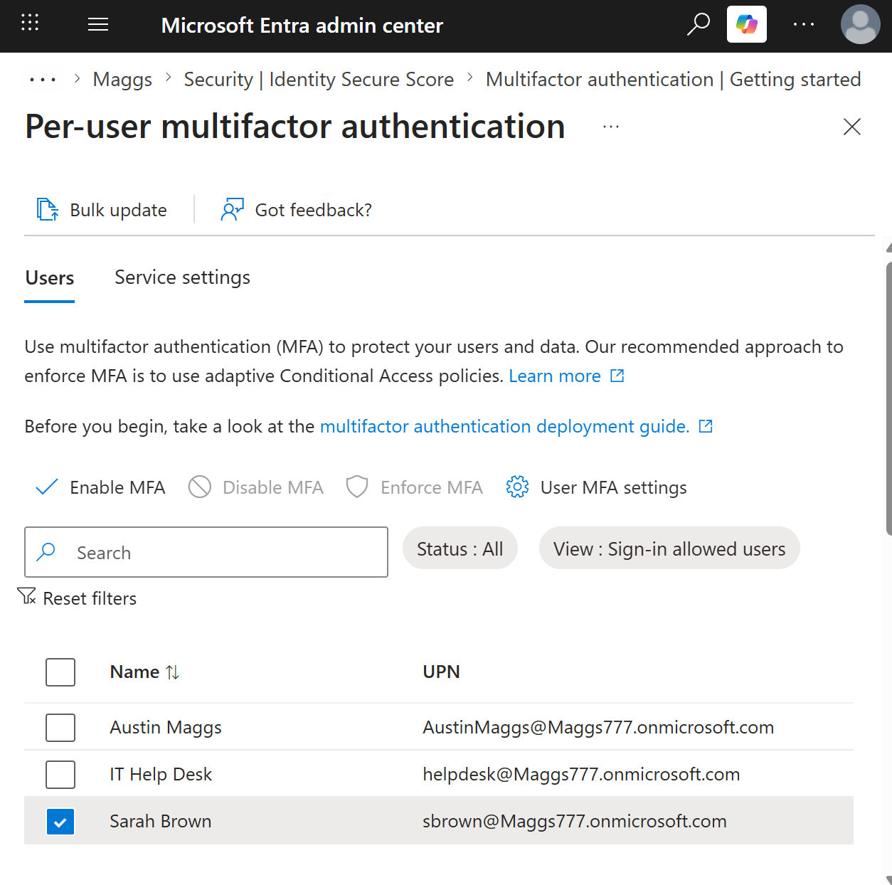
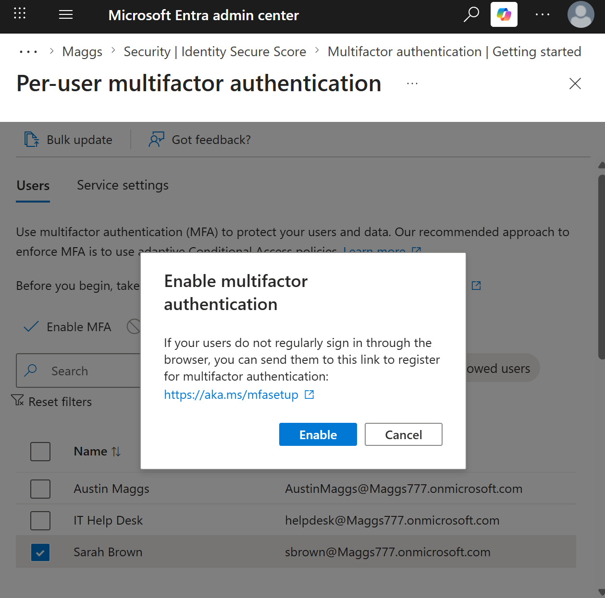
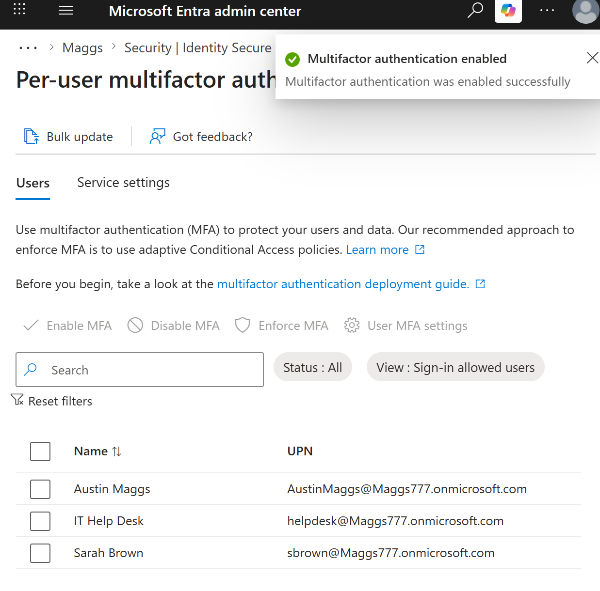
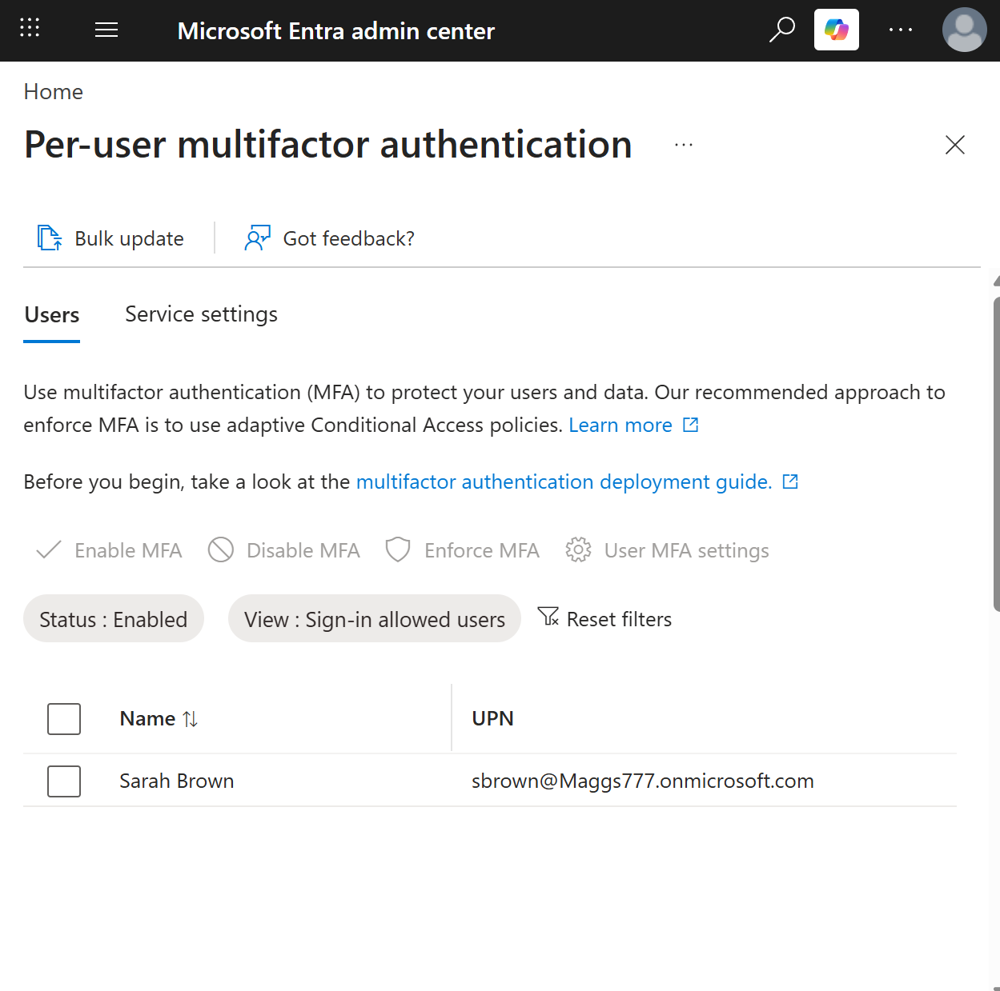
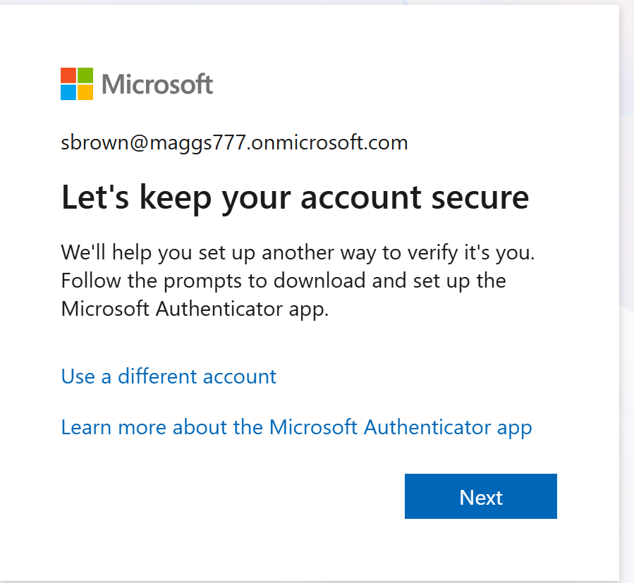
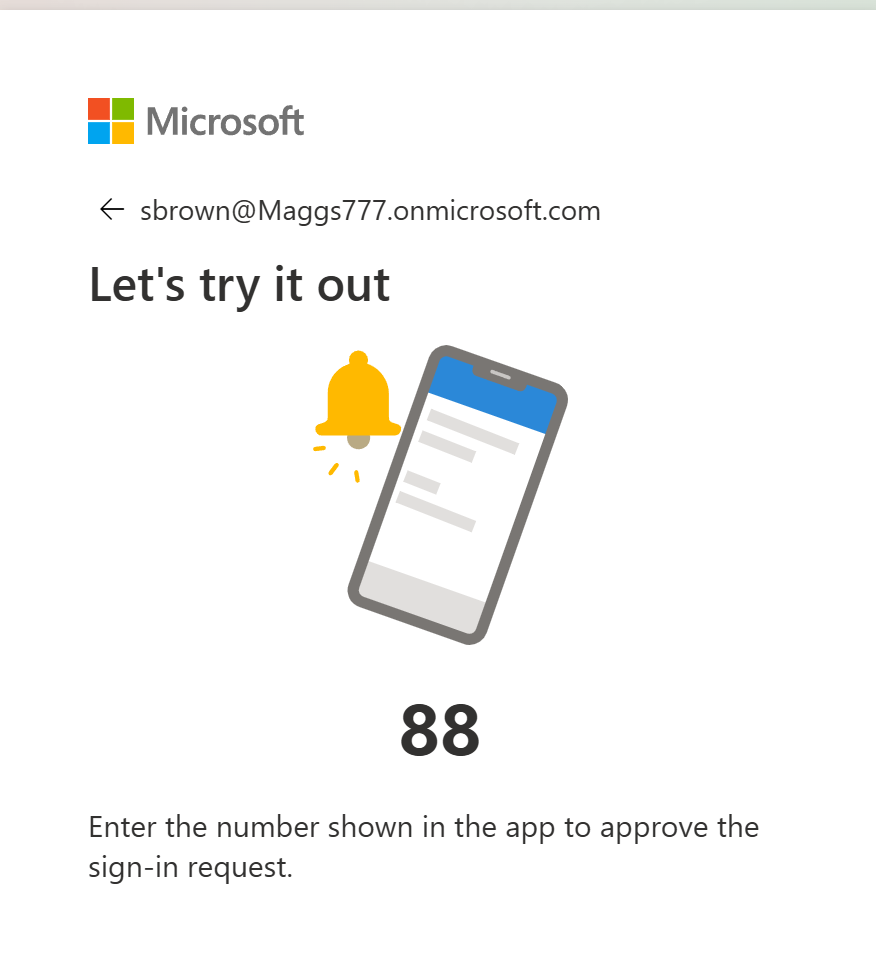
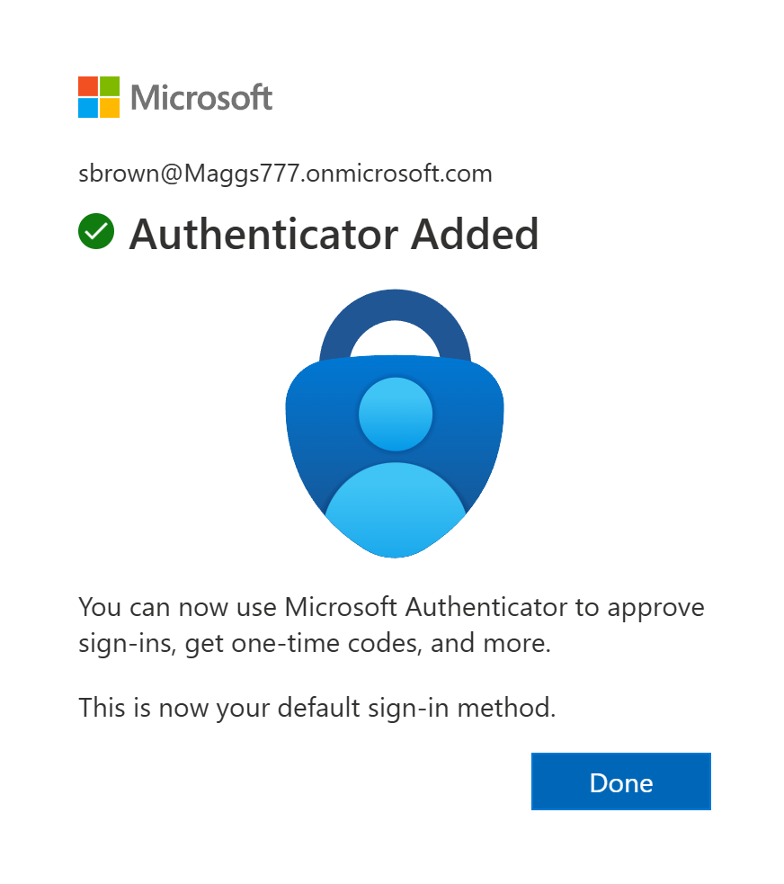

# M365-007 — Multi-Factor Authentication Deployment

## Objective

Enable and configure Multi-Factor Authentication (MFA) for a Microsoft 365 user account using the Microsoft Entra admin center.

This task demonstrates how Microsoft 365 administrators can enable per-user MFA, verify MFA status, require an end user to register an authentication method, configure Microsoft Authenticator, and validate the authentication method using number matching.

---

## Ticket Information

**Ticket ID:** M365-007

**Priority:** High

**Category:** Microsoft Entra ID / Identity Security

**Status:** Completed

---

## Scenario

Maggs Technology Services is strengthening its identity security posture by implementing Multi-Factor Authentication for a Microsoft 365 user account.

The administrator must enable MFA for **Sarah Brown** and verify that the MFA requirement is successfully applied to her account.

After MFA is enabled, the administrator must test the end-user sign-in experience to confirm that Sarah is required to register an additional authentication method.

Microsoft Authenticator will be configured as the authentication method, and the registration process will be validated using an MFA number-matching challenge.

The account will use the following configuration:

- **User:** Sarah Brown
- **User Principal Name:** sbrown@Maggs777.onmicrosoft.com
- **Security Control:** Multi-Factor Authentication
- **MFA Configuration:** Per-user MFA
- **Authentication Method:** Microsoft Authenticator
- **Verification Method:** Authenticator number matching
- **Default Sign-In Method:** Microsoft Authenticator
- **MFA Status:** Enabled

This ticket focuses specifically on the deployment and verification of **per-user MFA**. Conditional Access-based MFA policies are outside the scope of this ticket and will be addressed separately in **M365-009 — Conditional Access**.

---

## Environment

| Item | Value |
|---|---|
| Platform | Microsoft 365 |
| Identity Platform | Microsoft Entra ID |
| Administration Portal | Microsoft Entra Admin Center |
| Tenant | Maggs777.onmicrosoft.com |
| Target User | Sarah Brown |
| User Principal Name | sbrown@Maggs777.onmicrosoft.com |
| Security Control | Multi-Factor Authentication |
| MFA Configuration | Per-user MFA |
| Authentication Method | Microsoft Authenticator |
| Verification Method | Number Matching |
| MFA Status | Enabled |

---

## Resolution Steps

### 1. Locate User in Per-User Multi-Factor Authentication

Opened the **Microsoft Entra admin center** and navigated to the **Per-user multifactor authentication** management interface.

Located and selected **Sarah Brown** with the following User Principal Name:

**sbrown@Maggs777.onmicrosoft.com**

The user was selected in preparation for enabling Multi-Factor Authentication.

---

### 2. Initiate Multi-Factor Authentication Enablement

Selected **Enable MFA** for Sarah Brown.

The Microsoft Entra admin center displayed a confirmation prompt before enabling Multi-Factor Authentication for the selected user.

The prompt also provided guidance for users who need to register for Multi-Factor Authentication.

The MFA enablement action was confirmed.

---

### 3. Confirm Successful MFA Enablement

After confirming the administrative action, the Microsoft Entra admin center displayed a success notification confirming that Multi-Factor Authentication was enabled successfully.

This confirmed that the per-user MFA configuration had been successfully applied to Sarah Brown's account.

---

### 4. Verify MFA Status

Returned to the **Per-user multifactor authentication** interface to verify the configuration.

Applied the **Status: Enabled** filter and confirmed that **Sarah Brown** appeared in the results.

This verified that Sarah Brown's per-user MFA status was successfully configured as **Enabled**.

---

### 5. Verify End-User MFA Registration Requirement

Opened a separate private browser session and signed in using Sarah Brown's Microsoft 365 account.

After successful authentication, Microsoft displayed the **Let's keep your account secure** prompt.

The user was instructed to configure an additional method to verify their identity using the Microsoft Authenticator application.

This confirmed that enabling MFA at the administrative level successfully triggered the required MFA registration workflow for the end user.

---

### 6. Validate Microsoft Authenticator Using Number Matching

Microsoft Authenticator was configured as the user's authentication method.

During the registration process, Microsoft initiated an authentication test using **number matching**.

A number was displayed in the browser and entered into the Microsoft Authenticator application to approve the authentication request.

The number-matching process provides additional protection against accidental MFA approvals by requiring the user to interact with and verify the authentication request.

The authentication challenge was successfully approved through Microsoft Authenticator.

---

### 7. Verify Microsoft Authenticator Registration

After successfully completing the authentication challenge, Microsoft confirmed that **Microsoft Authenticator** had been added to Sarah Brown's account.

The confirmation screen also verified that Microsoft Authenticator was configured as the user's **default sign-in method**.

This confirmed that the MFA registration process was successfully completed and that Sarah Brown could use Microsoft Authenticator to approve future authentication requests.

---

## Verification

The MFA configuration was reviewed from both the administrator and end-user perspectives.

The following settings and actions were verified:

| Setting | Configuration | Status |
|---|---|---|
| Target User | Sarah Brown | Verified |
| User Principal Name | sbrown@Maggs777.onmicrosoft.com | Verified |
| Per-User MFA | Enabled | Verified |
| MFA Registration Required | Yes | Verified |
| Authentication Method | Microsoft Authenticator | Configured |
| Number Matching | Successfully Completed | Verified |
| Authenticator Registration | Successfully Completed | Verified |
| Default Sign-In Method | Microsoft Authenticator | Verified |

The Microsoft Entra admin center confirmed that Sarah Brown's per-user MFA status was **Enabled**.

The end-user sign-in process was then tested in a separate private browser session.

The user was required to register an additional authentication method before continuing, confirming that the MFA requirement was successfully applied.

Microsoft Authenticator was configured and validated through a number-matching authentication challenge.

The registration process completed successfully, and Microsoft Authenticator was confirmed as the user's default sign-in method.

---

## Result

Multi-Factor Authentication was successfully enabled for **Sarah Brown** using the Microsoft Entra admin center.

The account:

**sbrown@Maggs777.onmicrosoft.com**

was verified with a per-user MFA status of **Enabled**.

The end-user sign-in experience was tested to confirm that the account was required to register an additional authentication method.

Microsoft Authenticator was successfully configured and validated using number matching.

After completing the registration process, Microsoft confirmed that the Authenticator application had been successfully added and configured as Sarah Brown's default sign-in method.

The completed configuration demonstrates both the administrative deployment of MFA and the end-user authentication method registration process.

---

## Security Impact

Enabling Multi-Factor Authentication provides an additional layer of identity protection beyond username and password authentication.

If a user's password is compromised, an attacker would still require access to the user's registered authentication method to successfully complete an MFA-protected authentication request.

Microsoft Authenticator further strengthens the authentication process by requiring users to approve authentication requests through a registered device.

Number matching provides additional protection against MFA fatigue and accidental approvals by requiring users to enter the number displayed during the authentication attempt.

This configuration helps reduce the risk associated with:

- Compromised passwords
- Credential theft
- Password spraying attacks
- Unauthorized account access
- Accidental MFA approval
- MFA fatigue attacks

---

## Best Practices

- Require Multi-Factor Authentication for organizational user accounts.
- Prefer modern authentication methods such as Microsoft Authenticator over less secure authentication methods where possible.
- Use number matching to reduce the risk of MFA fatigue attacks.
- Verify that users successfully register their required authentication methods.
- Educate users to approve authentication requests only when they initiated the sign-in attempt.
- Investigate unexpected or repeated MFA requests.
- Regularly review authentication methods registered to user accounts.
- Use Conditional Access policies for scalable and policy-driven MFA enforcement in production Microsoft 365 environments.
- Apply the principle of least privilege when configuring administrative access.
- Maintain documented verification procedures for identity security changes.

---

## Skills Demonstrated

- Microsoft 365 Administration
- Microsoft Entra ID Administration
- Identity and Access Management (IAM)
- Multi-Factor Authentication (MFA)
- Per-User MFA Administration
- Microsoft Authenticator Configuration
- Authentication Method Registration
- MFA Deployment
- MFA Status Verification
- Number Matching
- Identity Security
- Account Security
- User Authentication
- End-User Sign-In Verification
- Administrative Verification
- Security Control Implementation
- Microsoft 365 Security
- Enterprise Technical Documentation

---

## Key Takeaways

- Multi-Factor Authentication adds an additional identity verification requirement beyond a user's password.
- Per-user MFA can be enabled for individual Microsoft 365 users through the Microsoft Entra administration interface.
- Administrators should verify that MFA configuration changes are successfully applied after making security changes.
- Enabling MFA can trigger the end-user authentication method registration workflow during the user's next sign-in.
- Microsoft Authenticator can be used as an MFA authentication method for Microsoft 365 accounts.
- Number matching requires the user to interact with the authentication request and helps protect against accidental MFA approvals and MFA fatigue attacks.
- Testing the end-user sign-in experience provides stronger verification than relying only on the administrator-side configuration.
- Successful Authenticator registration confirms that the user has configured an authentication method capable of completing future MFA challenges.
- Per-user MFA provides direct user-level MFA configuration, while Conditional Access provides more flexible policy-based enforcement for modern enterprise environments.
- MFA configuration and Conditional Access are related identity security controls but should be documented separately when demonstrating their individual administrative workflows.

---

## Conclusion

This task demonstrated the deployment and verification of Multi-Factor Authentication for a Microsoft 365 user using the Microsoft Entra admin center.

Per-user MFA was enabled for **Sarah Brown**, and the administrative configuration was verified by confirming that her MFA status was **Enabled**.

The end-user sign-in experience was then tested to verify that MFA registration was required.

Microsoft Authenticator was successfully configured as the authentication method and validated through a number-matching authentication challenge.

The final registration confirmation verified that Microsoft Authenticator had been successfully added and configured as the user's default sign-in method.

The completed ticket demonstrates practical experience with Microsoft Entra ID administration, identity and access management, Multi-Factor Authentication deployment, Microsoft Authenticator configuration, number matching, authentication method registration, user-side verification, and enterprise identity security practices.