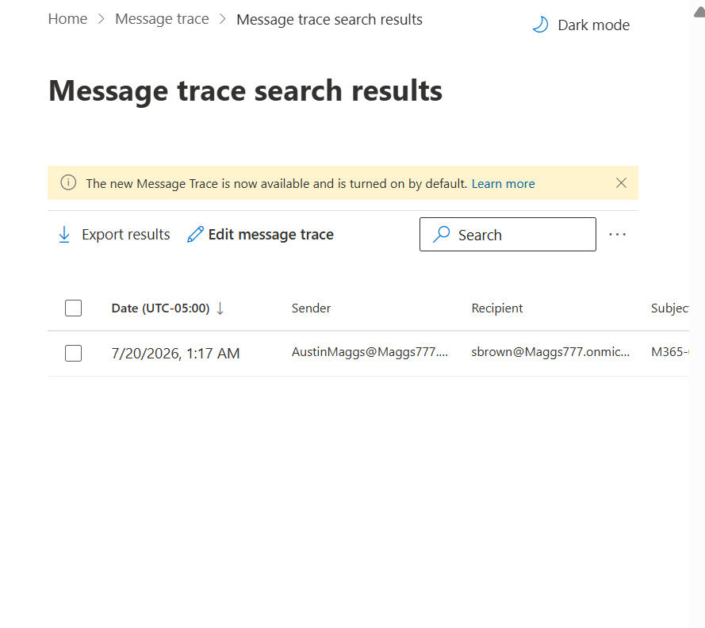
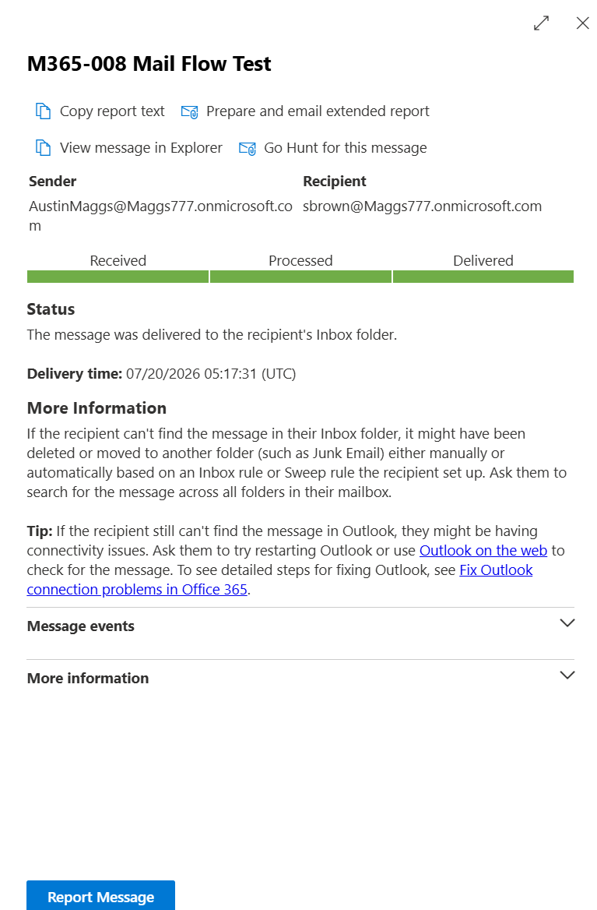
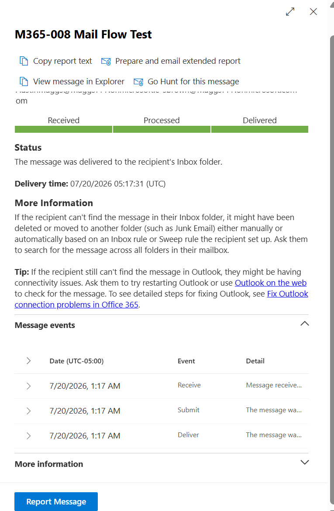

# M365-008 — Exchange Online Mail Flow Troubleshooting

## Ticket Information

| Field | Details |
|---|---|
| Ticket ID | M365-008 |
| Category | Exchange Online / Mail Flow |
| Priority | Medium |
| Status | Resolved |
| Environment | Microsoft 365 Business Premium |
| Administration Portal | Exchange Admin Center |
| Service | Exchange Online |
| Resolution Type | Message Trace and Mail Flow Verification |

---

# Objective

Verify successful email delivery between Microsoft 365 users and use the Exchange Admin Center Message Trace functionality to investigate and confirm the message's delivery status.

This scenario demonstrates how an administrator can troubleshoot reported email delivery issues by validating the end-user experience and tracing a message through the Exchange Online mail transport system.

---

# Scenario

A user reports that an expected email may not have been delivered successfully.

As the Microsoft 365 administrator, the objective is to:

1. Send a controlled test message between two Microsoft 365 users.
2. Verify whether the recipient received the message.
3. Access the Exchange Admin Center.
4. Perform a Message Trace to locate the test message.
5. Review the message delivery status.
6. Inspect the message events associated with the delivery.
7. Confirm whether Exchange Online successfully delivered the message to the recipient's mailbox.

For this test:

- **Sender:** Austin Maggs
- **Recipient:** Sarah Brown
- **Subject:** M365-008 Mail Flow Test

---

# Resolution

## Step 1 — Send a Test Email

Signed in to Outlook as **Austin Maggs** and sent a test email to **Sarah Brown**.

The test message used the following subject:

`M365-008 Mail Flow Test`

The message was created specifically to generate a controlled mail-flow event that could be investigated using Exchange Online Message Trace.


---

## Step 2 — Verify Message Receipt

Signed in to the recipient account for **Sarah Brown** and confirmed that the test email from Austin Maggs appeared in the mailbox.

This provided end-user verification that the message had successfully reached the recipient.


---

## Step 3 — Access Exchange Online Message Trace

Opened the **Exchange Admin Center** and navigated to:

**Mail flow → Message trace**

The Message Trace tool provides Exchange Online administrators with the ability to investigate the status and transport history of email messages processed by the organization.


---

## Step 4 — Perform a Message Trace Search

Created a new Message Trace search to locate the test message.

The trace was configured to search the relevant date and time range associated with the test email.

A summary report was used to provide immediate access to the available message trace information.

The initial Message Trace search returned **No data available**.

This demonstrated an important troubleshooting consideration: recently sent messages may not immediately appear in Message Trace results, or the selected search parameters may need to be reviewed and adjusted.

The trace was subsequently retried, and the test message appeared in the search results.



---

## Step 5 — Review Message Trace Details

Opened the Message Trace result for:

`M365-008 Mail Flow Test`

The trace confirmed the following mail-flow path:

**Received → Processed → Delivered**

The final status reported:

> The message was delivered to the recipient's Inbox folder.

The trace also displayed the recorded delivery time, confirming that Exchange Online successfully processed and delivered the message.



---

## Step 6 — Verify Message Events

Expanded the **Message events** section within the Message Trace details.

The following transport events were recorded:

| Event | Description |
|---|---|
| Receive | Exchange Online received the message for processing |
| Submit | The message was submitted into the Exchange Online transport pipeline |
| Deliver | The message was successfully delivered to the recipient's mailbox |

The complete message lifecycle confirmed that the message successfully passed through the Exchange Online transport process.



---

# Verification

The mail-flow troubleshooting process was successfully completed and verified through multiple methods.

### End-User Verification

Sarah Brown's mailbox was accessed and the test email from Austin Maggs was confirmed to be present.

### Message Trace Verification

Exchange Online Message Trace successfully located the test message and reported the final delivery status as:

**Delivered**

### Transport Event Verification

The Message Trace event history confirmed the following sequence:

**Receive → Submit → Deliver**

These results confirm that Exchange Online successfully received, processed, and delivered the test email to the recipient's Inbox.

---

# Troubleshooting Process

The troubleshooting workflow used during this ticket was:

```text
User reports possible email delivery issue
        ↓
Send controlled test email
        ↓
Verify recipient mailbox
        ↓
Access Exchange Admin Center
        ↓
Open Mail Flow → Message Trace
        ↓
Run Message Trace
        ↓
Initial search returns no data
        ↓
Retry / adjust Message Trace search
        ↓
Locate test message
        ↓
Open message trace details
        ↓
Verify Received → Processed → Delivered
        ↓
Review Message Events
        ↓
Confirm Receive → Submit → Deliver
        ↓
Mail flow verified successfully
```

---

# Root Cause Analysis

No Exchange Online mail-flow failure was identified.

The test message was successfully processed by Exchange Online and delivered to the recipient's Inbox.

The initial Message Trace search returned no results, but a subsequent trace successfully located the message. This may occur when recently processed messages have not yet appeared in trace results or when the search parameters require adjustment.

The investigation confirmed that the Exchange Online transport system was functioning correctly.

---

# Resolution Summary

A controlled email test was performed between two Microsoft 365 user accounts.

The recipient mailbox was checked to verify successful delivery.

The Exchange Admin Center Message Trace tool was then used to investigate the message's transport status.

After the initial trace returned no data, the trace was retried and successfully located the message.

The detailed Message Trace confirmed that the message progressed through the following stages:

**Received → Processed → Delivered**

Additional Message Events confirmed:

**Receive → Submit → Deliver**

The issue was resolved by verifying that Exchange Online successfully processed and delivered the message to the recipient's Inbox.

---

# Business Impact

Exchange Online mail-flow troubleshooting is an essential responsibility for Microsoft 365 administrators and IT support teams.

Message Trace allows administrators to determine whether a message:

- Was received by Exchange Online
- Entered the mail transport pipeline
- Was successfully processed
- Was successfully delivered
- Failed during transport
- Remains pending
- Was affected by mail-flow configuration

This enables administrators to distinguish between Exchange Online transport issues and client-side problems such as:

- Outlook connectivity issues
- Inbox rules
- Sweep rules
- Junk Email filtering
- Messages moved to another folder
- User error when searching for messages

Accurate message tracing reduces troubleshooting time and provides administrators with evidence of the message's transport and delivery status.

---

# Best Practices

- Use a controlled test message when troubleshooting mail-flow issues.
- Record the sender, recipient, subject, and approximate send time.
- Verify the recipient mailbox before assuming a transport failure.
- Use Exchange Online Message Trace to investigate message delivery.
- Select an appropriate date and time range when running traces.
- Allow time for recently sent messages to appear in Message Trace results.
- Review detailed message events when investigating delivery issues.
- Verify the final delivery status before closing a mail-flow ticket.
- Distinguish between Exchange transport issues and Outlook client-side issues.
- Document troubleshooting steps and verification results for future reference.

---

# Skills Demonstrated

- Microsoft 365 Administration
- Exchange Online Administration
- Exchange Admin Center
- Exchange Online Mail Flow
- Mail Flow Troubleshooting
- Message Trace
- Message Trace Analysis
- Email Delivery Troubleshooting
- Email Delivery Verification
- Exchange Online Transport
- Message Transport Analysis
- Message Event Analysis
- Mailbox Verification
- End-User Verification
- Troubleshooting Methodology
- Root Cause Analysis
- Administrative Verification
- Microsoft 365 Cloud Administration
- Enterprise Technical Documentation

---

# Screenshots

| Screenshot | Description |
|---|---|
| 01-Mail-Flow-Test-Sent.png | Test email sent from Austin Maggs to Sarah Brown |
| 02-Mail-Flow-Test-Received.png | Test email successfully received in Sarah Brown's mailbox |
| 03-Exchange-Message-Trace.png | Exchange Admin Center Message Trace interface |
| 04-Message-Trace-Search-Results.png | Message Trace search results showing the test message |
| 05-Message-Trace-Delivered.png | Detailed trace confirming successful delivery to the recipient's Inbox |
| 06-Message-Trace-Events-Verified.png | Message Events confirming Receive, Submit, and Deliver events |

---

# Outcome

**Ticket Status: Resolved**

Exchange Online mail flow was successfully tested and verified.

The controlled test message was delivered from Austin Maggs to Sarah Brown, and Exchange Online Message Trace confirmed successful message processing and delivery.

The message transport lifecycle was verified through the recorded **Receive**, **Submit**, and **Deliver** events.

This ticket demonstrates practical experience troubleshooting Exchange Online mail flow and using Message Trace to investigate and verify email delivery within a Microsoft 365 environment.