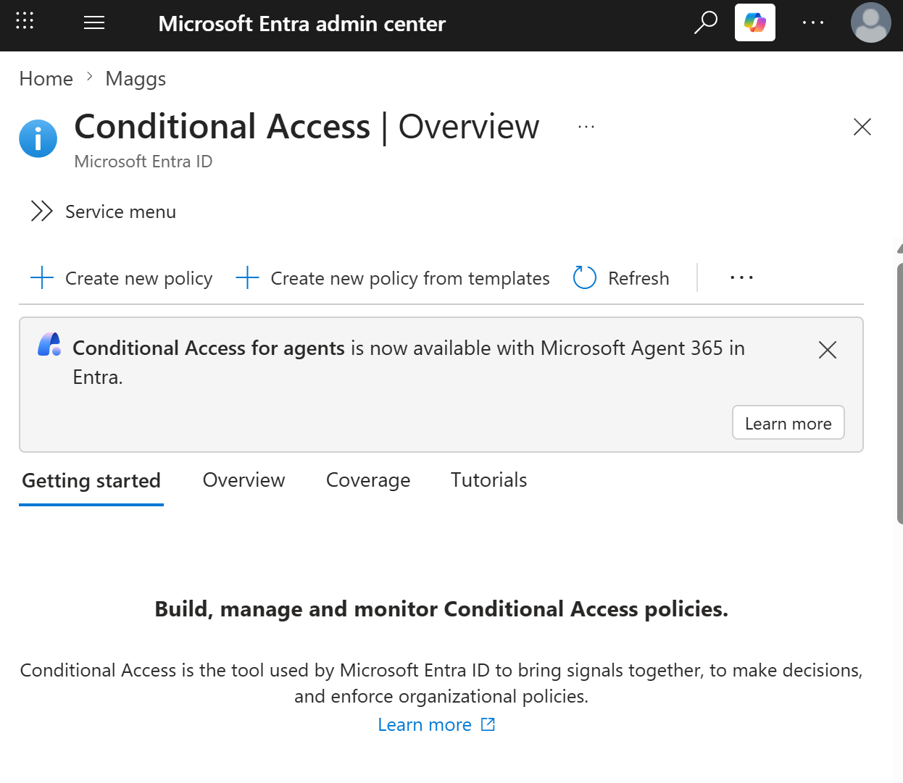
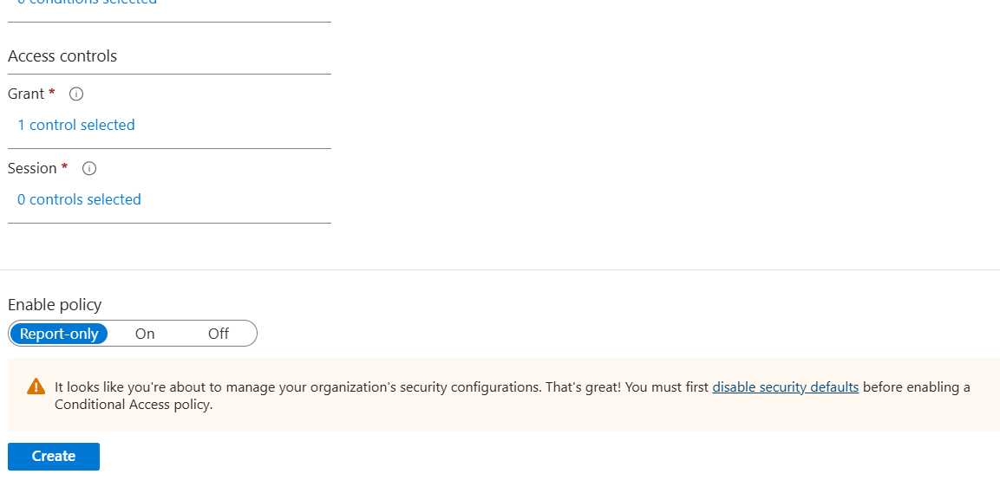
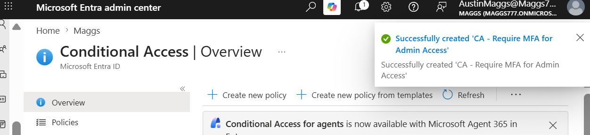
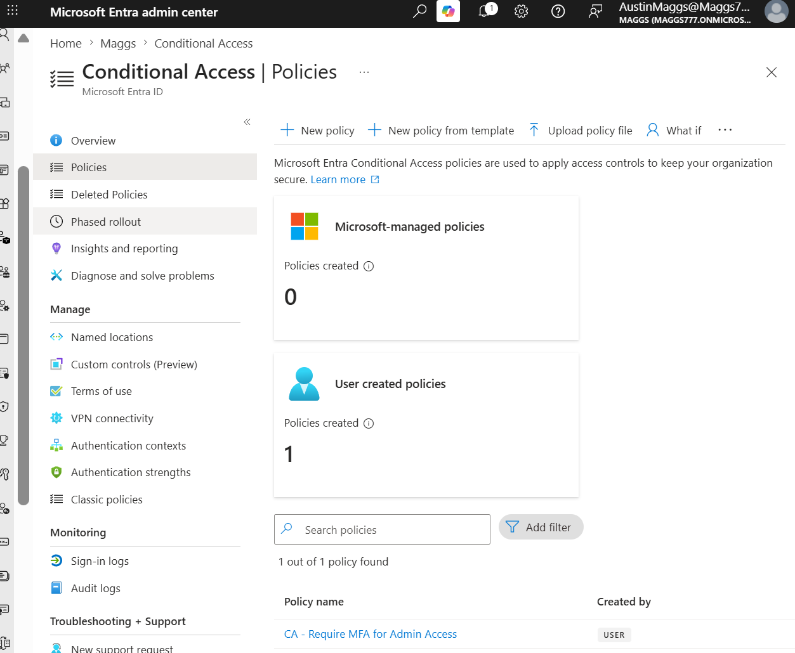
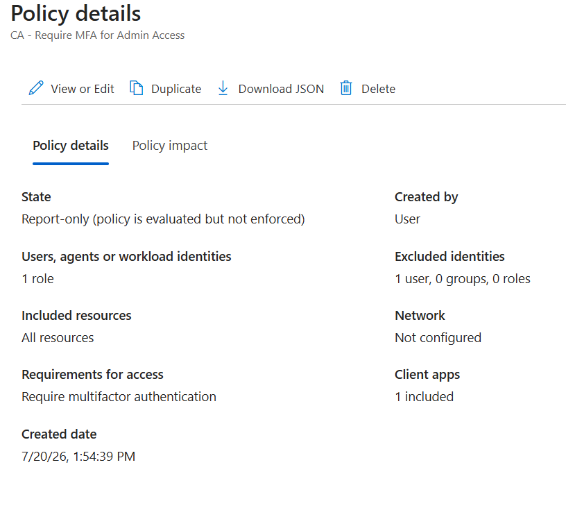
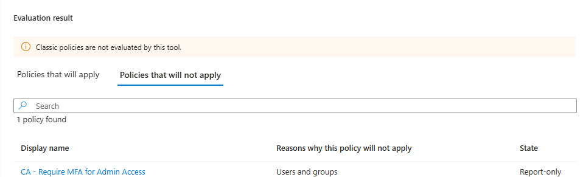

# M365-009 – Conditional Access

## Ticket Information

**Ticket ID:** M365-009  
**Category:** Microsoft Entra ID / Identity and Access Management  
**Issue Type:** Security Configuration  
**Status:** Resolved  

---

## Objective

Configure and validate a Microsoft Entra Conditional Access policy that requires multifactor authentication (MFA) for administrative access while reducing the risk of administrative lockout.

The policy was configured in **Report-only** mode to allow its impact to be evaluated before enforcement.

---

## Scenario

The organization requires stronger authentication controls for privileged administrative accounts. A Conditional Access policy must be created to require MFA when members of the **Global Administrator** directory role access organizational cloud resources.

To follow safe Conditional Access deployment practices in the lab environment, the administrative account used to configure the tenant is excluded from the policy to prevent accidental lockout. The policy is initially deployed in **Report-only** mode so its configuration and expected behavior can be validated before enforcement.

---

## Environment

- Microsoft 365 Business Premium tenant
- Microsoft Entra admin center
- Microsoft Entra ID
- Microsoft Entra Conditional Access
- Global Administrator directory role
- Multifactor authentication (MFA)

---

## Resolution Steps

### 1. Opened Conditional Access

Navigated to the Microsoft Entra admin center and opened **Conditional Access** to begin configuring a new policy.

---

### 2. Configured the Conditional Access Policy

Created a new Conditional Access policy with the following name:

`CA - Require MFA for Admin Access`

Configured the policy assignments to target the **Global Administrator** directory role.

To reduce the risk of administrative lockout during the lab, the administrative account used to manage the tenant was explicitly excluded from the policy.

Configured the target resources as:

`All resources (formerly 'All cloud apps')`

Under **Grant** controls, configured the policy to:

`Grant access` → `Require multifactor authentication`

The policy was left in **Report-only** mode rather than immediately enforced. This allows the policy's expected behavior to be evaluated before enabling it in a production-style deployment.

---

### 3. Created the Policy

Created the Conditional Access policy and confirmed that Microsoft Entra successfully created:

`CA - Require MFA for Admin Access`

---

### 4. Verified the Policy in the Conditional Access Policy List

Returned to the Conditional Access **Policies** page and verified that the new user-created policy appeared in the policy list.

The tenant showed one user-created Conditional Access policy:

`CA - Require MFA for Admin Access`

---

### 5. Reviewed the Policy Configuration

Opened the policy details and verified the final configuration.

The policy details confirmed:

- **State:** Report-only
- **Users, agents, or workload identities:** 1 role
- **Excluded identities:** 1 user
- **Included resources:** All resources
- **Requirement for access:** Require multifactor authentication
- **Network:** Not configured

This confirmed that the policy was correctly scoped to an administrative directory role, required MFA, targeted all resources, and contained an administrative account exclusion.

---

### 6. Validated the Policy Using the What If Tool

Used the Microsoft Entra Conditional Access **What If** tool to simulate a sign-in and evaluate whether the new policy would apply.

The test included:

- **Identity type:** Users
- **User:** Administrative account excluded from the policy
- **Target resource:** Office 365 Exchange Online
- **Device platform:** Windows
- **Client app:** Browser

The evaluation placed `CA - Require MFA for Admin Access` under **Policies that will not apply**.

The reason shown was:

`Users and groups`

This result confirmed that the configured user exclusion was functioning as intended and that the excluded administrative account would not be affected by the policy under the simulated sign-in conditions.

---

## Verification

The Conditional Access configuration was successfully verified by confirming that:

- The policy was successfully created.
- The **Global Administrator** directory role was targeted.
- An administrative account was excluded to reduce lockout risk.
- All resources were included in the policy scope.
- Multifactor authentication was configured as the required grant control.
- The policy remained in **Report-only** mode for safe evaluation.
- The policy appeared in the Conditional Access policy list.
- The policy details reflected the intended configuration.
- The Conditional Access **What If** tool confirmed that the excluded administrative account did not receive the policy.

---

## Result

The Conditional Access policy `CA - Require MFA for Admin Access` was successfully created and validated.

The policy was configured to require MFA for the targeted administrative role across all resources while excluding the designated administrative account used for lab access. The policy was deployed in **Report-only** mode to support safe testing before enforcement.

The **What If** evaluation successfully demonstrated that the exclusion operated as configured.

**Ticket Status: Resolved**

---

## Skills Demonstrated

- Microsoft Entra ID administration
- Conditional Access policy configuration
- Role-based Conditional Access assignments
- Multifactor authentication enforcement planning
- Privileged account security
- Administrative lockout prevention
- Conditional Access Report-only deployment
- Conditional Access policy validation
- Microsoft Entra What If tool usage
- Identity and access management
- Security policy documentation
- Troubleshooting and verification