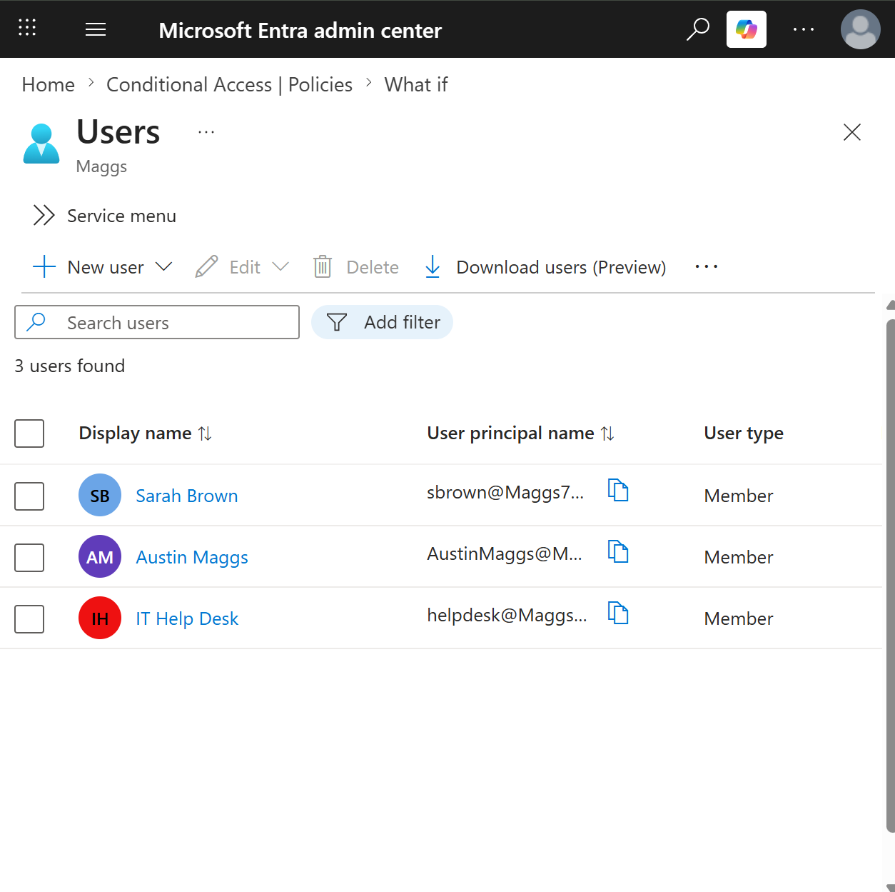
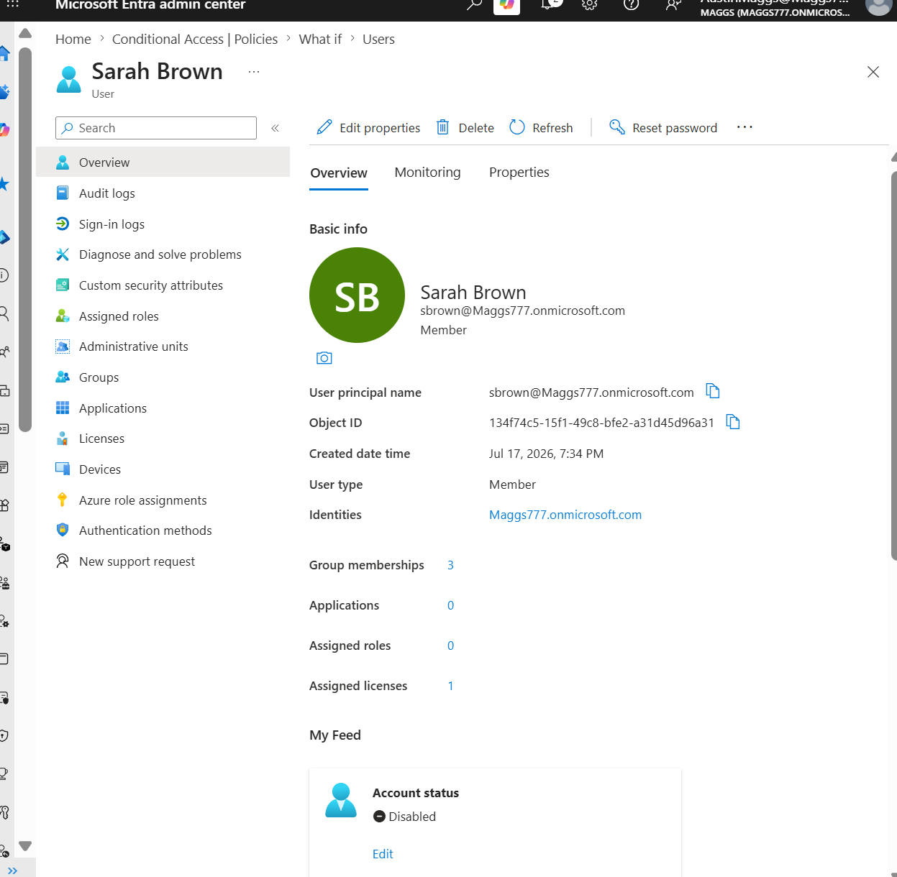
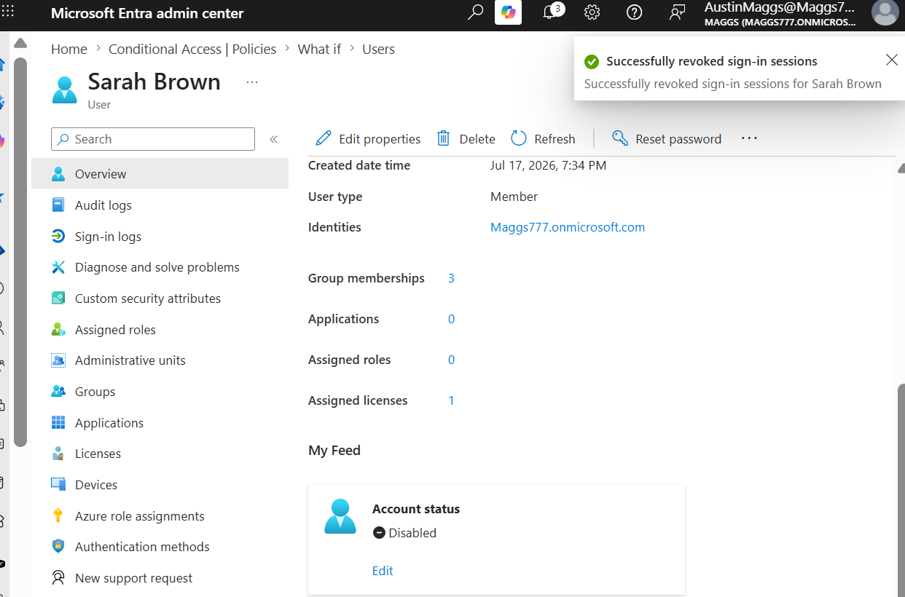
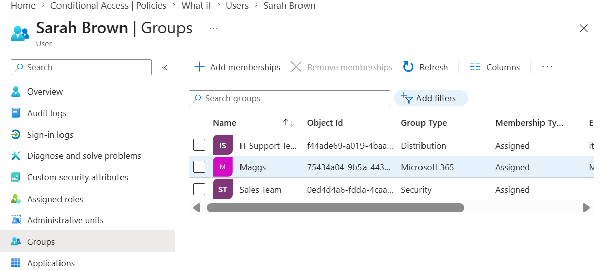
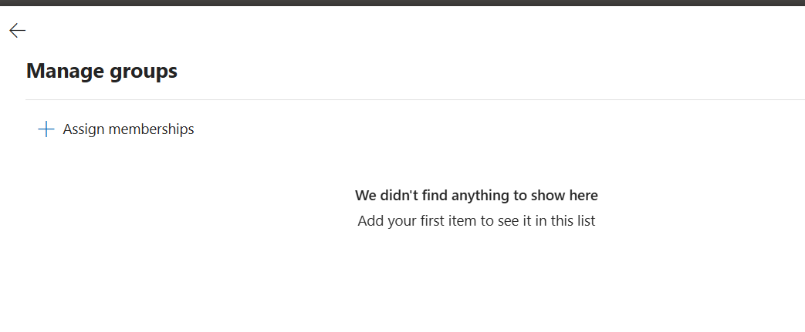
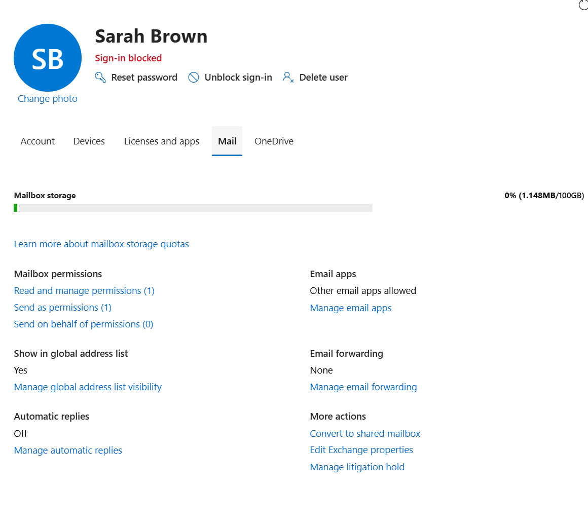
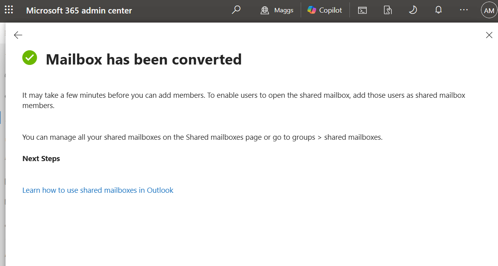
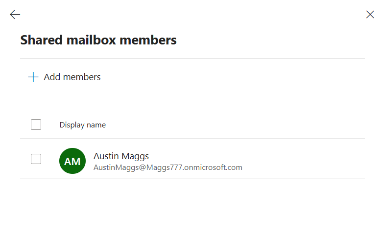
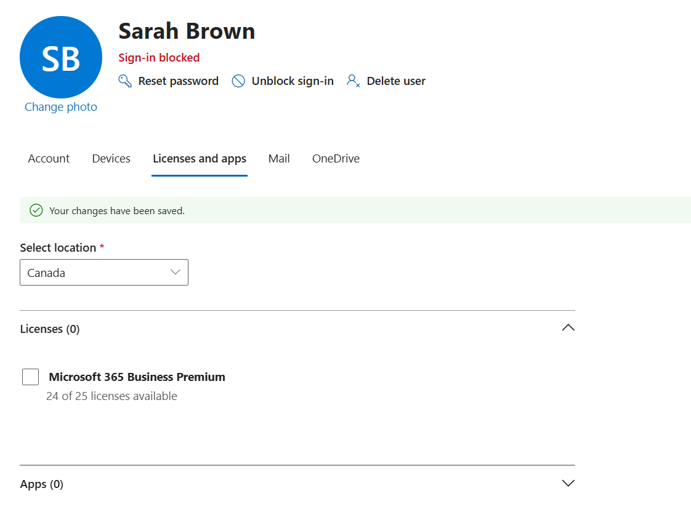
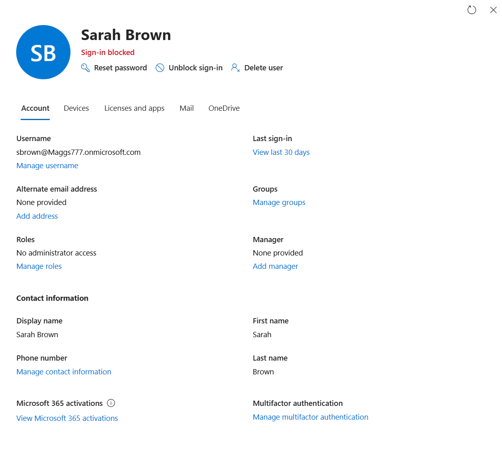

# M365-010 — User Offboarding

## Ticket Information

**Ticket ID:** M365-010  
**Category:** User Lifecycle Management  
**Platform:** Microsoft 365 / Microsoft Entra ID / Exchange Online  
**Environment:** Microsoft 365 Business Premium  
**Tenant:** Maggs777.onmicrosoft.com  
**Status:** Completed  

---

## Scenario

Human Resources notified IT that Sarah Brown has left the organization.

The objective of this ticket was to securely offboard the user while preserving business data and maintaining continuity of access for authorized personnel.

The offboarding process was performed in a controlled order to avoid premature data loss or disruption.

The workflow included:

- Identifying the departing user
- Blocking user sign-in
- Revoking active sign-in sessions
- Reviewing and removing group memberships
- Reviewing mailbox settings
- Converting the mailbox to a shared mailbox
- Verifying shared mailbox access
- Removing the Microsoft 365 Business Premium license
- Confirming the account remained secured and retained

The user account was not permanently deleted.

---

## User Information

**User:** Sarah Brown  
**Username:** sbrown@Maggs777.onmicrosoft.com  

Sarah Brown was selected as the user to be offboarded because the account represented a standard employee account within the lab environment.

---

## Step 1 — Identify the User Being Offboarded

The Microsoft Entra admin center was used to review the users currently present in the tenant.

The following lab accounts were identified:

- Sarah Brown
- Austin Maggs
- IT Help Desk

Sarah Brown was selected as the departing employee.

---

## Step 2 — Block User Sign-In

Sarah Brown's account status was changed from enabled to disabled.

Blocking sign-in prevents the former employee from authenticating to Microsoft 365 and Microsoft Entra resources.

The account itself was retained so that organizational data and configuration could be preserved during the remaining offboarding process.

---

## Step 3 — Revoke Active Sign-In Sessions

Existing sign-in sessions for Sarah Brown were revoked.

This invalidates active authentication sessions and helps prevent continued access through previously authenticated devices or applications.

The Microsoft Entra admin center confirmed that Sarah Brown's sign-in sessions were successfully revoked.

---

## Step 4 — Review Existing Group Memberships

Before removing Sarah Brown from organizational groups, her existing memberships were reviewed.

The account was found to be a member of:

- IT Support Team — Distribution group
- Maggs — Microsoft 365 group
- Sales Team — Security group

Reviewing group memberships before removal provides an audit trail of the user's previous access and communication permissions.

---

## Step 5 — Remove Group Memberships

Sarah Brown's group memberships were removed as part of the offboarding process.

An initial attempt to remove the memberships through the Microsoft Entra admin center resulted in a service connection error.

The Microsoft 365 admin center was then used to manage the remaining group membership. After the change propagated, no group memberships were displayed for the user.

Removing group memberships helps revoke access granted through security groups, collaboration groups, and distribution lists.

---

## Step 6 — Review Mailbox Settings

Before removing the user's license, Sarah Brown's mailbox configuration was reviewed.

The mailbox was still active and licensed at this stage.

The mailbox settings showed:

- Mailbox storage in use
- Existing mailbox permissions
- No email forwarding configured
- Automatic replies disabled
- Option available to convert the mailbox to a shared mailbox

Reviewing the mailbox before license removal ensured that business email data could be preserved.

---

## Step 7 — Convert Mailbox to Shared Mailbox

Sarah Brown's mailbox was converted from a user mailbox to a shared mailbox.

This preserved the mailbox and its historical business email while allowing authorized personnel to retain access after the employee's departure.

The Microsoft 365 admin center confirmed that the mailbox conversion completed successfully.

---

## Step 8 — Verify Shared Mailbox Access

Shared mailbox membership was reviewed after the mailbox conversion.

Austin Maggs was confirmed as an authorized member of the shared mailbox.

This ensured that organizational access to Sarah Brown's mailbox remained available for business continuity.

---

## Step 9 — Remove Microsoft 365 License

After the account was secured and the mailbox was preserved, Sarah Brown's Microsoft 365 Business Premium license was removed.

The Microsoft 365 admin center confirmed:

- Licenses assigned: 0
- Microsoft 365 Business Premium no longer assigned
- Changes successfully saved

Removing the license at this stage allowed the organization to reclaim the license without prematurely affecting mailbox preservation.

---

## Step 10 — Final Offboarding Verification

A final review of Sarah Brown's account confirmed that:

- The account still existed in the tenant
- Sign-in remained blocked
- The account had not been deleted
- No administrator access was assigned
- The mailbox had been preserved as a shared mailbox
- Authorized mailbox access remained available
- The Microsoft 365 Business Premium license had been removed

The account was intentionally retained in a secured state rather than permanently deleted.

---

## Result

Sarah Brown was successfully offboarded from the Microsoft 365 environment.

The completed workflow demonstrated a safe enterprise user offboarding process by securing the identity first, preserving organizational data, removing access, maintaining mailbox continuity, reclaiming the assigned license, and retaining the disabled account for administrative control.

---

## Skills Demonstrated

- Microsoft 365 user lifecycle management
- Microsoft Entra ID account administration
- User sign-in blocking
- Session revocation
- Group membership review and removal
- Exchange Online mailbox administration
- Shared mailbox conversion
- Mailbox delegation verification
- Microsoft 365 license management
- Data preservation during employee offboarding
- Business continuity planning
- Troubleshooting Microsoft 365 administrative errors
- Enterprise offboarding workflow execution