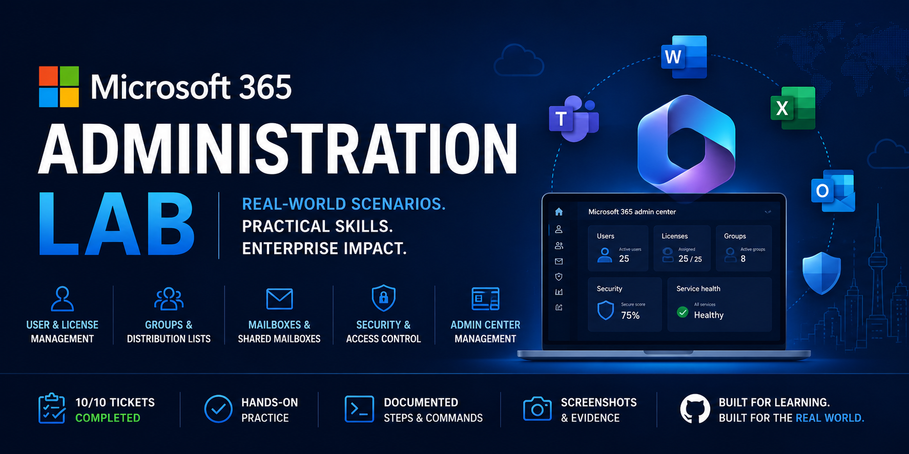

# Microsoft 365 Administration Lab


---

# Overview

This repository documents realistic Microsoft 365 administration scenarios performed within a Microsoft 365 Business Premium tenant.

The project simulates day-to-day responsibilities commonly performed by IT Support Specialists, Help Desk Technicians, Desktop Support Technicians, and Microsoft 365 Administrators.

Each ticket follows a structured enterprise documentation format including objectives, scenarios, resolution steps, verification, business impact, best practices, screenshots, and skills demonstrated.

---

# Lab Environment

| Component | Details |
|-----------|---------|
| Company | Maggs Technology Services |
| Tenant | Maggs777.onmicrosoft.com |
| Platform | Microsoft 365 Business Premium |
| Identity Platform | Microsoft Entra ID |
| Administration Portal | Microsoft 365 Admin Center |
| Location | Canada |
| Environment Type | Cloud Administration Lab |

---

# Technologies Used

- Microsoft 365 Business Premium
- Microsoft Entra ID
- Microsoft 365 Admin Center
- Exchange Online
- Microsoft Teams
- SharePoint Online
- OneDrive for Business
- Microsoft Defender
- Microsoft Intune
- Microsoft Graph
- PowerShell
- Git
- GitHub

---

# Skills Demonstrated

- Microsoft 365 Administration
- Microsoft Entra ID Administration
- User Provisioning
- User Lifecycle Management
- User Offboarding
- Employee Offboarding Procedures
- Identity and Access Management (IAM)
- License Management
- License Reclamation
- Password Management
- Account Management
- Account Disablement
- Sign-In Blocking
- Session Revocation
- Security Group Administration
- Group Membership Management
- Group Access Removal
- Role-Based Access Control Concepts
- Principle of Least Privilege
- Multi-Factor Authentication (MFA)
- Per-User MFA Administration
- MFA Deployment
- MFA Status Verification
- Microsoft Authenticator Configuration
- Authentication Method Registration
- Number Matching
- User Authentication
- End-User Sign-In Verification
- Identity Security
- Account Security
- Security Control Implementation
- Conditional Access
- Conditional Access Policy Configuration
- Conditional Access Report-Only Deployment
- Conditional Access What If Validation
- Directory Role Targeting
- Privileged Account Security
- Administrative Lockout Prevention
- Exchange Online Administration
- Exchange Admin Center
- Exchange Online Mail Flow
- Mail Flow Troubleshooting
- Message Trace
- Message Trace Analysis
- Email Delivery Troubleshooting
- Email Delivery Verification
- Exchange Online Transport
- Message Transport Analysis
- Message Event Analysis
- Mailbox Verification
- Mailbox Administration
- Mailbox Delegation
- Full Access Permission Management
- Send As Permission Management
- Shared Mailbox Administration
- Shared Mailbox Creation and Configuration
- User Mailbox to Shared Mailbox Conversion
- Mailbox Data Preservation
- Business Continuity
- User Access Management
- Permission Assignment
- Distribution Group Administration
- Distribution List Management
- Group Creation and Configuration
- Group Ownership Management
- Group Membership Management
- Email Distribution Management
- Access Control
- Troubleshooting Methodology
- Root Cause Analysis
- Administrative Verification
- Microsoft 365 Security
- Cloud Identity Management
- Enterprise Documentation
- PowerShell Administration

---

# Lab Objectives

- Provision Microsoft 365 users
- Assign and manage Microsoft 365 licenses
- Reset passwords and manage user accounts
- Create and manage security groups
- Manage security group membership
- Configure mailbox delegation permissions
- Manage Full Access and Send As mailbox permissions
- Configure shared mailboxes
- Configure distribution groups
- Deploy Multi-Factor Authentication
- Configure Conditional Access policies
- Troubleshoot Exchange Online mail flow
- Perform user offboarding procedures

---

# Ticket Tracker

| Ticket | Title | Status |
|---------|-------|--------|
| M365-001 | [User Creation and License Assignment](Documentation/M365-001-User-Creation.md) | ✅ Completed |
| M365-002 | [Password Reset and Account Management](Documentation/M365-002-Password-Reset-and-Account-Management.md) | ✅ Completed |
| M365-003 | [Security Group Creation and Membership Management](Documentation/M365-003-Security-Groups.md) | ✅ Completed |
| M365-004 | [Mailbox Management](Documentation/M365-004-Mailbox-Management.md) | ✅ Completed |
| M365-005 | [Distribution Group Creation and Management](Documentation/M365-005-Distribution-Groups.md) | ✅ Completed |
| M365-006 | [Shared Mailbox Creation and Management](Documentation/M365-006-Shared-Mailboxes.md) | ✅ Completed |
| M365-007 | [Multi-Factor Authentication Deployment](Documentation/M365-007-MFA-Deployment.md) | ✅ Completed |
| M365-008 | [Exchange Online Mail Flow Troubleshooting](Documentation/M365-008-Mail-Flow-Troubleshooting.md) | ✅ Completed |
| M365-009 | [Conditional Access](Documentation/M365-009-Conditional-Access.md) | ✅ Completed |
| M365-010 | [User Offboarding](Documentation/M365-010-User-Offboarding.md) | ✅ Completed |

---

# Repository Structure

```text
Microsoft-365-Administration-Lab/
│
├── README.md
│
├── Assets/
│   ├── Repo-Banner.png
│   ├── Architecture-Diagram.png
│   └── Icons/
│
├── Documentation/
│   ├── Commands-Used.md
│   ├── M365-Ticket-Tracker.md
│   ├── M365-001-User-Creation.md
│   ├── M365-002-Password-Reset-and-Account-Management.md
│   ├── M365-003-Security-Groups.md
│   ├── M365-004-Mailbox-Management.md
│   ├── M365-005-Distribution-Groups.md
│   ├── M365-006-Shared-Mailboxes.md
│   ├── M365-007-MFA-Deployment.md
│   ├── M365-008-Mail-Flow-Troubleshooting.md
│   ├── M365-009-Conditional-Access.md
│   └── M365-010-User-Offboarding.md
│
└── Screenshots/
    ├── M365-001-User-Creation/
    ├── M365-002-Password-Reset/
    ├── M365-003-Security-Groups/
    ├── M365-004-Mailbox-Management/
    ├── M365-005-Distribution-Groups/
    ├── M365-006-Shared-Mailboxes/
    ├── M365-007-MFA-Deployment/
    ├── M365-008-Mail-Flow-Troubleshooting/
    ├── M365-009-Conditional-Access/
    └── M365-010-User-Offboarding/
```

---

# Completed Labs

## M365-001 — User Creation and License Assignment

Created and configured a Microsoft 365 user account within the Microsoft 365 Admin Center and assigned the appropriate Microsoft 365 license.

**Key Skills:**

- Microsoft 365 user provisioning
- User account configuration
- License assignment
- Microsoft 365 Admin Center
- Cloud identity administration

[View M365-001 Documentation](Documentation/M365-001-User-Creation.md)

---

## M365-002 — Password Reset and Account Management

Performed an administrator-initiated password reset for a Microsoft 365 user, required the user to change the temporary password at the next sign-in, and verified successful account access.

**Key Skills:**

- Password administration
- User account management
- Identity and access management
- Microsoft 365 Admin Center
- End-user sign-in verification

[View M365-002 Documentation](Documentation/M365-002-Password-Reset-and-Account-Management.md)

---

## M365-003 — Security Group Creation and Membership Management

Created a Microsoft 365 security group for the Sales department and configured group membership by adding a user to the group.

The configuration was verified through the Microsoft 365 Admin Center to confirm successful group creation and membership assignment.

**Key Skills:**

- Security group administration
- Group membership management
- Identity and access management
- Role-based access control concepts
- Principle of least privilege
- Microsoft 365 Admin Center

[View M365-003 Documentation](Documentation/M365-003-Security-Groups.md)

---

## M365-004 — Mailbox Management

Configured mailbox delegation permissions for a Microsoft 365 user through the Exchange Admin Center.

Granted **Read and Manage (Full Access)** and **Send As** permissions to an authorized delegate and verified that both permissions were successfully assigned.

**Key Skills:**

- Exchange Online administration
- Exchange Admin Center
- Mailbox administration
- Mailbox delegation
- Full Access permission management
- Send As permission management
- Access control
- Administrative verification

[View M365-004 Documentation](Documentation/M365-004-Mailbox-Management.md)

---

## M365-005 — Distribution Group Creation and Management

Created and configured the **IT Support Team** distribution group through the Exchange Admin Center to provide a centralized email address for team communication and service-related announcements.

Configured **Austin Maggs** as the group owner, added **Austin Maggs** and **Sarah Brown** as members, assigned **itsupport@Maggs777.onmicrosoft.com** as the group email address, disabled external senders, and configured both joining and leaving policies as **Closed**.

The completed configuration was verified in the Exchange Admin Center to confirm that the distribution group was successfully created and available within Exchange Online.

**Key Skills:**

- Exchange Online administration
- Exchange Admin Center
- Distribution group administration
- Distribution list management
- Group creation and configuration
- Group ownership management
- Group membership management
- Email distribution management
- Access control
- Administrative verification

[View M365-005 Documentation](Documentation/M365-005-Distribution-Groups.md)

---

## M365-006 — Shared Mailbox Creation and Management

Created and configured the **IT Help Desk** shared mailbox through the Exchange Admin Center to provide a centralized mailbox for IT Help Desk communications.

Configured **helpdesk@Maggs777.onmicrosoft.com** as the shared mailbox email address and granted **Austin Maggs** and **Sarah Brown** both **Read and Manage (Full Access)** and **Send As** permissions.

The completed configuration was verified in the Exchange Admin Center to confirm that the mailbox was successfully provisioned as a **SharedMailbox** and that both users were assigned the required mailbox delegation permissions.

**Key Skills:**

- Exchange Online administration
- Exchange Admin Center
- Shared mailbox administration
- Shared mailbox creation and configuration
- Mailbox delegation
- Full Access permission management
- Send As permission management
- User access management
- Access control
- Permission assignment
- Administrative verification

[View M365-006 Documentation](Documentation/M365-006-Shared-Mailboxes.md)

---

## M365-007 — Multi-Factor Authentication Deployment

Enabled and configured **Multi-Factor Authentication (MFA)** for **Sarah Brown** through the Microsoft Entra admin center using per-user MFA.

Verified that Sarah Brown's MFA status was successfully configured as **Enabled**, then tested the end-user sign-in experience to confirm that MFA registration was required.

Configured **Microsoft Authenticator** as the user's authentication method and successfully validated the registration using an MFA **number-matching** challenge.

The completed configuration was verified by confirming that Microsoft Authenticator was successfully added to Sarah Brown's account and configured as her **default sign-in method**.

**Key Skills:**

- Microsoft Entra ID administration
- Identity and access management
- Multi-Factor Authentication (MFA)
- Per-user MFA administration
- MFA deployment
- MFA status verification
- Microsoft Authenticator configuration
- Authentication method registration
- Number matching
- Identity security
- User authentication
- End-user sign-in verification
- Account security
- Security control implementation
- Conditional Access policy configuration
- Directory role targeting
- Conditional Access Report-only deployment
- Conditional Access What If validation
- Privileged account security
- Administrative lockout prevention
- Administrative verification

[View M365-007 Documentation](Documentation/M365-007-MFA-Deployment.md)

---

## M365-008 — Exchange Online Mail Flow Troubleshooting

Performed a controlled Exchange Online mail-flow test by sending an email from **Austin Maggs** to **Sarah Brown** with the subject **M365-008 Mail Flow Test**.

Verified successful delivery from the end-user perspective by signing in to Sarah Brown's mailbox and confirming that the test message was received.

Used the **Exchange Admin Center Message Trace** functionality to investigate the message's transport and delivery status. The initial Message Trace search returned no data, requiring the trace to be retried before the test message appeared in the search results.

Opened the detailed Message Trace and verified that the message successfully progressed through the **Received → Processed → Delivered** mail-flow stages. The final status confirmed that the message was successfully delivered to the recipient's Inbox.

Expanded the Message Events section and verified the underlying **Receive → Submit → Deliver** transport events, confirming that Exchange Online successfully received, processed, and delivered the message.

The completed troubleshooting process confirmed that no Exchange Online mail-flow failure was present and demonstrated the use of Message Trace to distinguish Exchange transport issues from potential client-side or mailbox-level issues.

**Key Skills:**

- Microsoft 365 administration
- Exchange Online administration
- Exchange Admin Center
- Exchange Online mail flow
- Mail flow troubleshooting
- Message Trace
- Message Trace analysis
- Email delivery troubleshooting
- Email delivery verification
- Exchange Online transport
- Message transport analysis
- Message event analysis
- Mailbox verification
- End-user verification
- Troubleshooting methodology
- Root cause analysis
- Administrative verification
- Microsoft 365 cloud administration
- Enterprise technical documentation

[View M365-008 Documentation](Documentation/M365-008-Mail-Flow-Troubleshooting.md)

---


## M365-009 — Conditional Access

Created and configured the **CA - Require MFA for Admin Access** Conditional Access policy through the Microsoft Entra admin center to strengthen authentication requirements for privileged administrative access.

Configured the policy to target the **Global Administrator** directory role, apply to **All resources (formerly 'All cloud apps')**, and require **Multi-Factor Authentication (MFA)** as the grant control.

Excluded the administrative account used to manage the lab tenant to reduce the risk of accidental administrative lockout and deployed the policy in **Report-only** mode to safely evaluate its behavior before enforcement.

Verified the completed policy configuration by reviewing the Conditional Access policy details, confirming that one directory role was targeted, one user was excluded, all resources were included, and MFA was configured as the access requirement.

Used the Conditional Access **What If** tool to simulate access to **Office 365 Exchange Online** from a **Windows** device using a **Browser** client. The evaluation placed the policy under **Policies that will not apply** with **Users and groups** identified as the reason, confirming that the configured administrative account exclusion functioned as intended.

**Key Skills:**

- Microsoft Entra ID administration
- Conditional Access policy configuration
- Role-based Conditional Access assignments
- Directory role targeting
- Multi-Factor Authentication enforcement planning
- Privileged account security
- Administrative lockout prevention
- Conditional Access Report-only deployment
- Conditional Access policy validation
- Microsoft Entra What If tool usage
- Identity and access management
- Security policy documentation
- Administrative verification
- Troubleshooting and verification

[View M365-009 Documentation](Documentation/M365-009-Conditional-Access.md)

---

## M365-010 — User Offboarding

Performed a controlled employee offboarding workflow for **Sarah Brown** across the Microsoft 365 Admin Center and Microsoft Entra admin center.

Immediately secured the departing user's identity by blocking account sign-in and revoking active sign-in sessions.

Reviewed Sarah Brown's existing group memberships before removing access associated with organizational security, collaboration, and distribution groups. During the process, an initial group membership removal attempt through the Microsoft Entra admin center encountered a service connection error. The Microsoft 365 Admin Center was used to complete the membership change and verify that no memberships remained displayed for the user.

Reviewed the user's Exchange Online mailbox configuration before making licensing changes to prevent premature disruption or loss of access to organizational email data.

Converted Sarah Brown's user mailbox to a **shared mailbox** to preserve historical business email and verified that **Austin Maggs** retained authorized access to the shared mailbox for business continuity.

After the account was secured and mailbox data was preserved, removed Sarah Brown's **Microsoft 365 Business Premium** license to reclaim the license for future organizational use.

Performed a final account review and verified that Sarah Brown's identity remained in the tenant with **sign-in blocked**. The user account was intentionally retained rather than permanently deleted.

**Key Skills:**

- Microsoft 365 user lifecycle management
- Employee user offboarding
- Microsoft Entra ID account administration
- Account disablement
- Sign-in blocking
- Session revocation
- Group membership review
- Group access removal
- Exchange Online mailbox administration
- User mailbox to shared mailbox conversion
- Shared mailbox administration
- Mailbox delegation verification
- Mailbox data preservation
- Business continuity
- Microsoft 365 license management
- License reclamation
- Identity and access management
- Account security
- Administrative troubleshooting
- Administrative verification
- Enterprise offboarding workflow execution
- Enterprise technical documentation

[View M365-010 Documentation](Documentation/M365-010-User-Offboarding.md)

---

# Learning Outcomes

This repository demonstrates practical experience with Microsoft 365 cloud administration by documenting realistic enterprise support and administration scenarios using Microsoft's administrative tools and industry best practices.

The objective is to build hands-on experience equivalent to common operational tasks performed in modern Microsoft 365 environments while maintaining professional documentation standards suitable for an IT portfolio.

Through the completed labs, this project currently demonstrates practical experience with:

- Microsoft 365 user provisioning
- Microsoft 365 license assignment
- Microsoft 365 license reclamation
- Password reset procedures
- User account management
- User lifecycle management
- Employee user offboarding
- Account disablement and sign-in blocking
- Active session revocation
- Security group creation
- Security group membership management
- Group membership review and removal
- Identity and access management
- Exchange Online administration
- Exchange Admin Center
- Mailbox administration
- Mailbox delegation
- Full Access permission management
- Send As permission management
- Distribution group administration
- Distribution list management
- Group creation and configuration
- Group ownership management
- Group membership management
- Email distribution management
- Shared mailbox administration
- Shared mailbox creation and configuration
- User mailbox to shared mailbox conversion
- Mailbox data preservation
- Business continuity
- User access management
- Permission assignment
- Access control
- Multi-Factor Authentication deployment
- Per-user MFA administration
- MFA status verification
- Microsoft Authenticator configuration
- Authentication method registration
- MFA number matching
- Identity security
- User authentication
- End-user MFA registration and sign-in verification
- Security control implementation
- Conditional Access policy configuration
- Conditional Access Report-only deployment
- Conditional Access policy validation
- Microsoft Entra What If tool usage
- Privileged account security
- Administrative lockout prevention
- Exchange Online mail flow troubleshooting
- Exchange Online Message Trace
- Message Trace analysis
- Email delivery troubleshooting and verification
- Exchange Online transport analysis
- Message event analysis
- Mailbox delivery verification
- End-user mail flow verification
- Troubleshooting methodology
- Root cause analysis
- Cloud-based administration
- Administrative verification and troubleshooting
- Enterprise technical documentation

The 10-ticket Microsoft 365 Administration Lab is complete, demonstrating an end-to-end collection of practical Microsoft 365 administration scenarios covering user provisioning, identity and access management, Exchange Online administration, authentication security, Conditional Access, troubleshooting, and employee offboarding.

---

# References

- Microsoft Learn
- Microsoft 365 Admin Center
- Microsoft Entra Admin Center
- Exchange Admin Center
- Microsoft Graph Documentation